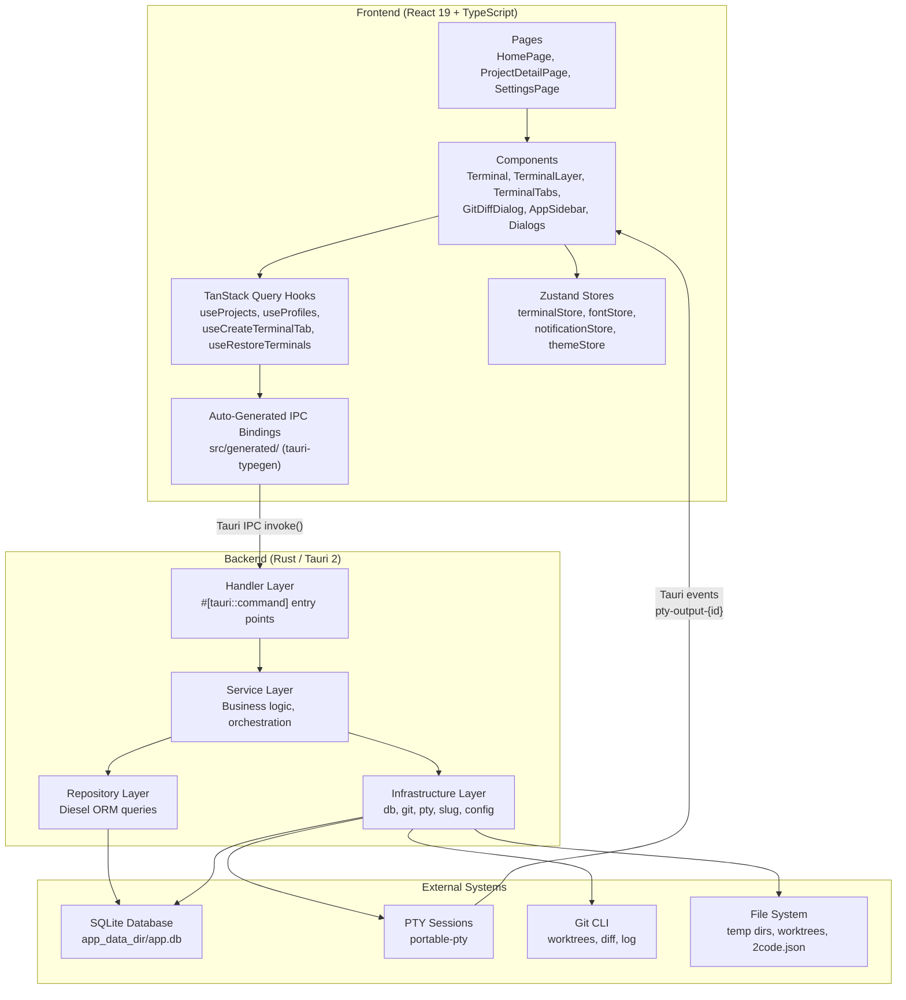

# Architecture

## Architecture Diagram

## Architecture Pattern

**Layered Architecture** with a 4-layer backend and a reactive frontend.

The backend follows a strict dependency flow: Handler -> Service -> Repository/Infrastructure. Each layer has a single responsibility:

1. **Handler** - Tauri command registration, state extraction, lock acquisition
2. **Service** - Domain logic, cross-cutting orchestration
3. **Repository** - Database CRUD via Diesel ORM
4. **Infrastructure** - External system integration (git CLI, PTY, filesystem, config)

The frontend uses a hooks-based architecture where TanStack Query manages all server state and Zustand handles ephemeral client state.

## Core Components

### Handler Layer (`src-tauri/src/handler/`)

- **Location**: `handler/project.rs`, `handler/pty.rs`, `handler/profile.rs`, `handler/font.rs`, `handler/sound.rs`
- **Responsibility**: Thin entry points for Tauri IPC commands. Extracts `State<DbPool>` and `State<PtySessionMap>`, acquires mutex lock, delegates to service layer.
- **Key interfaces**: 25 `#[tauri::command]` functions registered in `lib.rs`
- **Dependencies**: `service/*`, `infra::db::DbPool`, `infra::pty::PtySessionMap`

### Service Layer (`src-tauri/src/service/`)

- **Location**: `service/project.rs`, `service/pty.rs`, `service/profile.rs`
- **Responsibility**: Business logic -- project creation (temp dir + git init), PTY session lifecycle with background output streaming, profile creation (worktree + setup scripts), context ID resolution for git operations.
- **Key interfaces**: `create_temporary()`, `create_session()`, `create()` (profile), `mark_all_closed()`, `get_diff()`, `get_log()`
- **Dependencies**: `repo/*`, `infra/*`

### Repository Layer (`src-tauri/src/repo/`)

- **Location**: `repo/project.rs`, `repo/pty.rs`, `repo/profile.rs`
- **Responsibility**: Database access -- CRUD operations, session history retrieval, output chunk management, context folder resolution.
- **Key interfaces**: `insert()`, `find_by_id()`, `list_all()`, `resolve_context_folder()`, `insert_output_chunk()`, `get_chunk_sizes()`
- **Dependencies**: Diesel ORM, `schema.rs`

### Infrastructure Layer (`src-tauri/src/infra/`)

- **Location**: `infra/db.rs`, `infra/git.rs`, `infra/pty.rs`, `infra/slug.rs`, `infra/config.rs`
- **Responsibility**: External system integration -- database initialization with embedded migrations, git operations via CLI (init, diff, log, show, worktree add/remove, branch delete), PTY session creation/management, CJK-aware slug generation, project config loading and script execution.
- **Key interfaces**: `init_db()`, `create_session()` (PTY), `worktree_add()`, `diff()`, `log()`, `show()`, `slugify_cjk()`, `load_project_config()`, `execute_scripts()`
- **Dependencies**: `portable-pty`, `diesel_migrations`, `pinyin`, `dirs`

### Model Layer (`src-tauri/src/model/`)

- **Location**: `model/project.rs`, `model/pty.rs`, `model/profile.rs`
- **Responsibility**: Data types -- Diesel `Queryable` structs (`Project`, `Profile`, `PtySessionRecord`), `Insertable` structs (`NewProject`, `NewProfile`, `NewPtySessionRecord`), `AsChangeset` structs (`UpdateProject`, `UpdateProfile`), and non-DB types (`GitCommit`, `GitAuthor`, `PtyConfig`, `PtySessionMeta`)
- **Dependencies**: `diesel`, `serde`, `schema.rs`

### TerminalLayer (`src/components/TerminalLayer.tsx`)

- **Location**: `src/components/TerminalLayer.tsx`
- **Responsibility**: Persistent overlay that renders all open terminal sessions across all routes. Uses CSS `display: none` to hide inactive terminals without unmounting xterm.js instances. Builds a context map from both projects and profiles to resolve context IDs to working directories.
- **Dependencies**: `terminalStore`, `useRestoreTerminals`, `listProjects`, `listProfiles`

### Terminal (`src/components/Terminal.tsx`)

- **Location**: `src/components/Terminal.tsx`
- **Responsibility**: Individual xterm.js terminal instance. Handles session restoration from scrollback history, live PTY output via Tauri event listeners (`pty-output-{id}`, `pty-exit-{id}`), user input forwarding via `writeToPty`, dynamic resize via `ResizeObserver` + `FitAddon`.
- **Dependencies**: `@xterm/xterm`, `@xterm/addon-fit`, `fontStore`, Tauri event API

### GitDiffDialog (`src/components/GitDiffDialog.tsx`)

- **Location**: `src/components/GitDiffDialog.tsx`
- **Responsibility**: Modal dialog for viewing working-tree diffs and browsing commit history. Left sidebar with tabbed file list (Changes/History), right pane with syntax-highlighted unified diffs via `@pierre/diffs` and Shiki.
- **Dependencies**: `@pierre/diffs`, `getGitDiff`, `getGitLog`, `getCommitDiff`, Shiki themes mapped to terminal themes

### Auto-Generated IPC Bindings (`src/generated/`)

- **Location**: `src/generated/commands.ts`, `src/generated/types.ts`, `src/generated/index.ts`
- **Responsibility**: Type-safe TypeScript wrappers for all Rust `#[tauri::command]` functions. Generated by `tauri-typegen` from Rust source code.
- **Dependencies**: `@tauri-apps/api/core` (`invoke`)

## State Management

### Frontend State (Zustand Stores)

| Store               | Location                          | Persisted                       | Purpose                                              |
| ------------------- | --------------------------------- | ------------------------------- | ---------------------------------------------------- |
| `terminalStore`     | `src/stores/terminalStore.ts`     | No (rebuilt from DB on startup) | Terminal tabs per context, active tab, restore flags |
| `fontStore`         | `src/stores/fontStore.ts`         | Yes (localStorage)              | Font family, font size, terminal theme preferences   |
| `notificationStore` | `src/stores/notificationStore.ts` | Yes (localStorage)              | Notification sound/enabled preferences               |
| `themeStore`        | `src/stores/themeStore.ts`        | Yes (localStorage)              | Dark/light mode preference                           |

### Backend State (Rust, Tauri-managed)

| State           | Type                                      | Purpose                       |
| --------------- | ----------------------------------------- | ----------------------------- |
| `PtySessionMap` | `Arc<Mutex<HashMap<String, PtySession>>>` | Active PTY sessions in memory |
| `DbPool`        | `Arc<Mutex<SqliteConnection>>`            | Single SQLite connection      |

## Key Design Decisions

**Single DB connection with mutex**: Uses `Arc<Mutex<SqliteConnection>>` instead of a connection pool. Simplifies the codebase at the cost of concurrent write throughput -- acceptable for a single-user desktop app.

**CSS display toggling for terminals**: xterm.js instances are never unmounted during route changes or tab switches. This preserves terminal state (scrollback, cursor position) without re-rendering overhead.

**Context ID polymorphism**: Git operations accept a `contextId` that can be either a project ID or profile ID. `repo::project::resolve_context_folder()` checks profiles first, then falls back to projects, enabling a unified API for both regular project folders and worktree-isolated profiles.

**PTY output dual-threading**: One thread reads PTY output and emits real-time Tauri events for the terminal UI. A separate persistence thread receives raw bytes via mpsc channel, buffers to 32KB, and flushes to SQLite -- decoupling UI responsiveness from database write latency.

**Embedded Diesel migrations**: Migrations are compiled into the binary via `embed_migrations!()` and run automatically on startup, ensuring the database schema is always current without requiring external migration tooling.

**Auto-generated TypeScript bindings**: `tauri-typegen` generates typed IPC wrappers directly from Rust command signatures, eliminating manual API layer maintenance and preventing type drift between frontend and backend.
