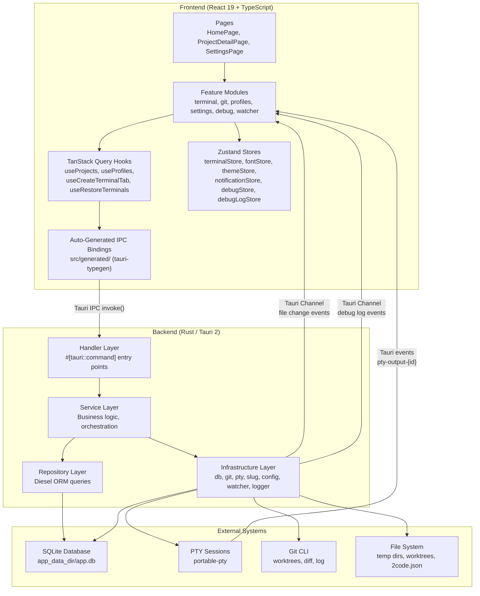

# Architecture

## Architecture Diagram

## Architecture Pattern

**Layered Architecture** with a 4-layer backend and a feature-based reactive frontend.

The backend follows a strict dependency flow: Handler -> Service -> Repository/Infrastructure. Each layer has a single responsibility:

1. **Handler** - Tauri command registration, state extraction, lock acquisition
2. **Service** - Domain logic, cross-cutting orchestration
3. **Repository** - Database CRUD via Diesel ORM
4. **Infrastructure** - External system integration (git CLI, PTY, filesystem, config, file watcher, logger)

The frontend uses a feature-based architecture where each feature module contains its own components, hooks, and stores. TanStack Query manages all server state and Zustand handles ephemeral client state.

## Core Components

### Handler Layer (`src-tauri/src/handler/`)

- **Files**: `project.rs`, `pty.rs`, `profile.rs`, `font.rs`, `sound.rs`, `watcher.rs`, `debug.rs`
- **Responsibility**: Thin entry points for Tauri IPC commands. Extracts `State<DbPool>` and `State<PtySessionMap>`, acquires mutex lock, delegates to service layer.
- **Key interfaces**: 22 `#[tauri::command]` functions registered in `lib.rs`
- **Dependencies**: `service/*`, `infra::db::DbPool`, `infra::pty::PtySessionMap`

### Service Layer (`src-tauri/src/service/`)

- **Files**: `project.rs`, `pty.rs`, `profile.rs`, `watcher.rs`
- **Responsibility**: Business logic -- project creation (temp dir + git init + default profile), PTY session lifecycle with background output streaming, profile creation (branch sanitization + worktree + setup scripts), file watcher coordination with debouncing.
- **Key interfaces**: `create_temporary()`, `create_from_folder()`, `create_session()`, `create()` (profile), `mark_all_closed()`, `get_diff()`, `get_log()`, `watcher::start()`
- **Dependencies**: `repo/*`, `infra/*`

### Repository Layer (`src-tauri/src/repo/`)

- **Files**: `project.rs`, `pty.rs`, `profile.rs`
- **Responsibility**: Database access -- CRUD operations, session history retrieval, output chunk management with pruning, profile lookups.
- **Key interfaces**: `insert()`, `find_by_id()`, `list_all()`, `list_all_with_profiles()`, `insert_output_chunk()`, `get_chunk_sizes()`, `delete_chunks_by_ids()`
- **Dependencies**: Diesel ORM, `schema.rs`

### Infrastructure Layer (`src-tauri/src/infra/`)

- **Files**: `db.rs`, `git.rs`, `pty.rs`, `slug.rs`, `config.rs`, `watcher.rs`, `logger.rs`
- **Responsibility**: External system integration -- database initialization with embedded migrations and pragmas (`WAL`, `foreign_keys`), git operations via CLI (init, diff, log, show, worktree add/remove, branch delete), PTY session creation/management, CJK-aware slug generation (pinyin), project config loading and script execution, filesystem watcher lifecycle, tracing-to-frontend log forwarding.
- **Key interfaces**: `init_db()`, `create_session()` (PTY), `worktree_add()`, `diff()`, `log()`, `show()`, `slugify_cjk()`, `load_project_config()`, `execute_scripts()`, `ChannelLayer::new()`, `ChannelLayerHandle::attach()`
- **Dependencies**: `portable-pty`, `diesel_migrations`, `pinyin`, `dirs`, `notify`, `tracing`, `tracing-subscriber`

### Model Layer (`src-tauri/src/model/`)

- **Files**: `project.rs`, `pty.rs`, `profile.rs`, `watcher.rs`, `debug.rs`
- **Responsibility**: Data types -- Diesel `Queryable` structs (`Project`, `Profile`, `PtySessionRecord`), `Insertable` structs (`NewProject`, `NewProfile`, `NewPtySessionRecord`), `AsChangeset` structs (`UpdateProject`, `UpdateProfile`), composite types (`ProjectWithProfiles`), and non-DB types (`GitCommit`, `GitAuthor`, `PtyConfig`, `PtySessionMeta`, `WatchEvent`, `LogEntry`)
- **Dependencies**: `diesel`, `serde`, `schema.rs`

### Frontend Feature Modules (`src/features/`)

#### Terminal (`src/features/terminal/`)

- **Files**: `Terminal.tsx`, `TerminalLayer.tsx`, `TerminalTabs.tsx`, `TerminalPreview.tsx`, `store.ts`, `hooks.ts`, `themes.ts`
- **Responsibility**: Persistent terminal overlay that renders all open terminal sessions across all routes. Uses CSS `display: none` to hide inactive terminals without unmounting xterm.js instances. Individual terminals handle session restoration from scrollback history, live PTY output via Tauri event listeners, user input forwarding, and dynamic resize via `ResizeObserver` + `FitAddon`.
- **Dependencies**: `@xterm/xterm`, `@xterm/addon-fit`, Tauri event API, Zustand store

#### Git (`src/features/git/`)

- **Files**: `GitDiffDialog.tsx`, `ProjectTopBar.tsx`, `hooks.ts`, `utils.ts`, `components/ChangesFileList.tsx`, `components/CommitList.tsx`, `components/GitDiffPane.tsx`, `components/HistoryFileList.tsx`
- **Responsibility**: Git diff viewing (working-tree changes + commit history), branch display in top bar, syntax-highlighted unified diffs via `@pierre/diffs`.
- **Dependencies**: `@pierre/diffs`, TanStack Query hooks for git commands

#### Settings (`src/features/settings/`)

- **Files**: `SettingsPage.tsx`, `FontPicker.tsx`, `FontSizePicker.tsx`, `TerminalThemePicker.tsx`, `AccentColorPicker.tsx`, `BorderRadiusPicker.tsx`, `SoundPicker.tsx`, `NotificationSettings.tsx`, `stores/fontStore.ts`, `stores/themeStore.ts`, `stores/notificationStore.ts`, `stores/terminalSettingsStore.ts`
- **Responsibility**: User preferences for fonts, terminal themes, accent colors, border radius, notification sounds. All preference stores use Zustand persist middleware (localStorage).

#### Debug (`src/features/debug/`)

- **Files**: `DebugFloat.tsx`, `DebugLogDialog.tsx`, `debugStore.ts`, `debugLogStore.ts`, `useDebugLogger.ts`
- **Responsibility**: Debug log panel toggled via `Cmd+Shift+D`. Receives Rust `tracing` events via Tauri Channel, displays with level badges, timestamp, source, and searchable message content.

#### Watcher (`src/features/watcher/`)

- **Files**: `useFileWatcher.ts`
- **Responsibility**: Subscribes to file change events from the backend watcher. Invalidates relevant TanStack Query caches (git branch, diff, log) when project files change on disk.

### Auto-Generated IPC Bindings (`src/generated/`)

- **Files**: `commands.ts`, `types.ts`, `index.ts`
- **Responsibility**: Type-safe TypeScript wrappers for all Rust `#[tauri::command]` functions. Generated by `tauri-typegen` from Rust source code.
- **Dependencies**: `@tauri-apps/api/core` (`invoke`)

## State Management

### Frontend State (Zustand Stores)

| Store                    | Location                                           | Persisted                       | Purpose                                              |
| ------------------------ | -------------------------------------------------- | ------------------------------- | ---------------------------------------------------- |
| `terminalStore`          | `src/features/terminal/store.ts`                   | No (rebuilt from DB on startup) | Terminal tabs per context, active tab, restore flags  |
| `fontStore`              | `src/features/settings/stores/fontStore.ts`        | Yes (localStorage)              | Font family, font size preferences                   |
| `terminalSettingsStore`  | `src/features/settings/stores/terminalSettingsStore.ts` | Yes (localStorage)         | Terminal theme preference                            |
| `notificationStore`      | `src/features/settings/stores/notificationStore.ts`| Yes (localStorage)              | Notification sound/enabled preferences               |
| `themeStore`             | `src/features/settings/stores/themeStore.ts`       | Yes (localStorage)              | Accent color, border radius preferences              |
| `debugStore`             | `src/features/debug/debugStore.ts`                 | No                              | Debug panel enabled/open state                       |
| `debugLogStore`          | `src/features/debug/debugLogStore.ts`              | No                              | In-memory log entries for debug panel                 |

### Backend State (Rust, Tauri-managed)

| State                | Type                                      | Purpose                                      |
| -------------------- | ----------------------------------------- | -------------------------------------------- |
| `PtySessionMap`      | `Arc<Mutex<HashMap<String, PtySession>>>` | Active PTY sessions in memory                |
| `DbPool`             | `Arc<Mutex<SqliteConnection>>`            | Single SQLite connection                     |
| `WatcherShutdownFlag`| `Arc<AtomicBool>`                         | Signals file watcher thread to stop on exit  |
| `ChannelLayerHandle` | Custom handle for tracing layer           | Attaches/detaches frontend debug log channel |

## Key Design Decisions

**Single DB connection with mutex**: Uses `Arc<Mutex<SqliteConnection>>` instead of a connection pool. Simplifies the codebase at the cost of concurrent write throughput -- acceptable for a single-user desktop app.

**CSS display toggling for terminals**: xterm.js instances are never unmounted during route changes or tab switches. This preserves terminal state (scrollback, cursor position) without re-rendering overhead.

**Profile-first data model**: After the `profile_first_refactor` migration, PTY sessions belong to profiles (not directly to projects). Every project has a default profile (`is_default = true`) that points to the project's own folder, enabling a unified API where all operations go through profiles.

**PTY output dual-threading**: One thread reads PTY output and emits real-time Tauri events for the terminal UI. A separate persistence thread receives raw bytes via mpsc channel, buffers to 32KB, and flushes to SQLite -- decoupling UI responsiveness from database write latency.

**Embedded Diesel migrations**: Migrations are compiled into the binary via `embed_migrations!()` and run automatically on startup, ensuring the database schema is always current without requiring external migration tooling.

**Auto-generated TypeScript bindings**: `tauri-typegen` generates typed IPC wrappers directly from Rust command signatures, eliminating manual API layer maintenance and preventing type drift between frontend and backend.

**Feature-based frontend organization**: Each feature (`terminal`, `git`, `settings`, `debug`, `watcher`, `projects`, `profiles`, `home`) is self-contained with its own components, hooks, and stores, reducing cross-feature coupling.

**Tracing-based debug logging**: The backend uses Rust's `tracing` crate with a custom `ChannelLayer` that forwards log events (INFO and above) to the frontend via a Tauri Channel when the debug panel is active. The forwarder runs on a dedicated thread to avoid blocking logging calls.
