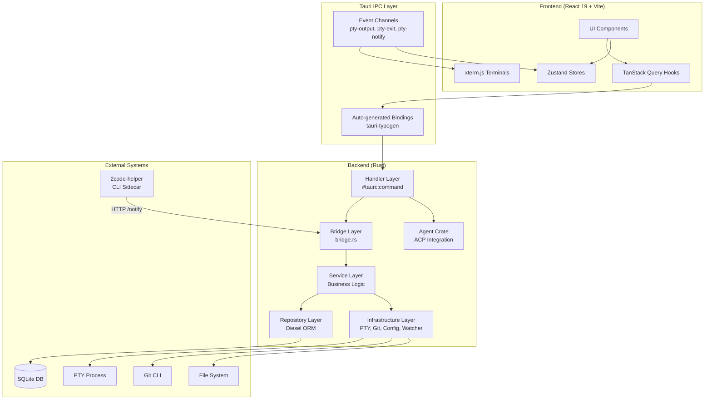
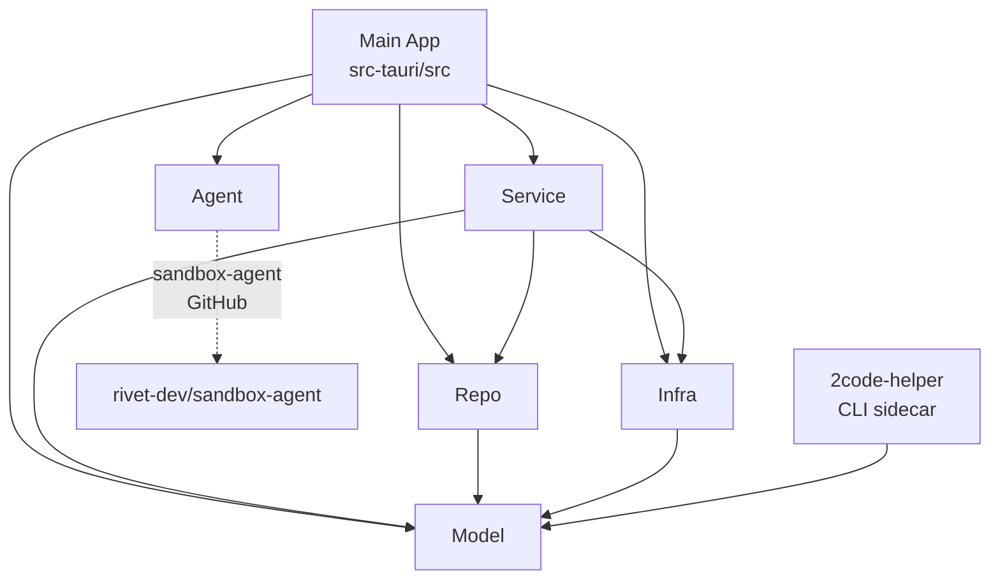

# Architecture

## Architecture Diagram

## Architecture Pattern

The project follows a **layered architecture** with **feature-based frontend organization**:

- **Frontend**: Feature modules (terminal, projects, git, settings) each own their components, hooks, and stores. Shared utilities live in `shared/`. State is split between Zustand (client) and TanStack Query (server).
- **Backend**: 5 layers with strict dependency direction (Handler → Bridge → Service → Repo/Infra). The bridge layer implements dependency inversion — service traits define interfaces, bridge provides Tauri-specific implementations.

## Workspace Crate Dependency Graph

## Core Components

### Frontend

#### Terminal Feature (`src/features/terminal/`)

- **Responsibility**: Manages PTY terminal sessions with xterm.js, tab UI, and scrollback persistence
- **Key interfaces**: `useCreateTerminalTab()`, `useCloseTerminalTab()`, `useTerminalTheme()`
- **Dependencies**: xterm.js, Zustand store, Tauri events, TanStack Query
- **Deep dive**: [Terminal System](./components/terminal-system.md)

#### Projects Feature (`src/features/projects/`)

- **Responsibility**: Project CRUD operations, detail page, folder/temporary project creation
- **Key interfaces**: `useProjects()`, `useCreateProject()`, `useDeleteProject()`
- **Dependencies**: TanStack Query, Tauri IPC

#### Git Feature (`src/features/git/`)

- **Responsibility**: Git diff viewer, commit history browser with syntax highlighting
- **Key interfaces**: `useGitDiffFiles()`, `useGitLog()`, `useCommitDiffFiles()`, `GitDiffDialog`
- **Dependencies**: @pierre/diffs (patch parsing), Shiki (highlighting), TanStack Query
- **Deep dive**: [Git Integration](./components/git-integration.md)

#### Settings Feature (`src/features/settings/`)

- **Responsibility**: App settings (terminal font/theme, accent color, notifications, agents)
- **Key interfaces**: `terminalSettingsStore`, `themeStore`, `notificationStore`, `AgentSettings`
- **Dependencies**: Zustand (persisted), Chakra UI, Tauri plugin-store

#### Top Bar Feature (`src/features/topbar/`)

- **Responsibility**: Customizable top bar with drag-and-drop control ordering
- **Key interfaces**: `topBarStore`, `ControlRegistry`, built-in controls (git-diff, vscode, github-desktop)
- **Dependencies**: @dnd-kit/core, @dnd-kit/sortable, Zustand

#### Layout (`src/layout/`)

- **Responsibility**: App sidebar with project navigation, profile list, keyboard navigation
- **Key interfaces**: `AppSidebar`, `ProjectMenuItem`, `ProfileList`, `ProfileItem`
- **Dependencies**: react-router, Zustand terminal store (notification dots)

#### Shared (`src/shared/`)

- **Responsibility**: Query client config, centralized query keys, theme provider, fallback components
- **Key interfaces**: `queryKeys`, `queryClient`, `ThemeProvider`, `PageSkeleton`, `PageError`
- **Dependencies**: TanStack Query, next-themes, Chakra UI

### Backend

#### Handler (`src-tauri/src/handler/`)

- **Responsibility**: Tauri `#[tauri::command]` entry points — extract state, delegate to service
- **Key interfaces**: 28 IPC commands across 8 modules (pty, project, profile, font, sound, watcher, debug, agent)
- **Dependencies**: Tauri state extraction, service layer, agent crate

| Module | Commands |
|--------|----------|
| `project.rs` | `create_project_temporary`, `create_project_from_folder`, `list_projects`, `update_project`, `delete_project`, `get_git_branch`, `get_git_diff`, `get_git_log`, `get_commit_diff` |
| `pty.rs` | `create_pty_session`, `write_to_pty`, `resize_pty`, `close_pty_session`, `list_project_sessions`, `get_pty_session_history`, `delete_pty_session_record`, `restore_pty_session`, `flush_pty_output` |
| `profile.rs` | `create_profile`, `delete_profile` |
| `agent.rs` | `list_agent_status`, `install_agent`, `detect_credentials` |
| `watcher.rs` | `watch_projects` |
| `font.rs` | `list_system_fonts` |
| `sound.rs` | `list_system_sounds`, `play_system_sound` |
| `debug.rs` | `start_debug_log`, `stop_debug_log` |

#### Bridge (`src-tauri/src/bridge.rs`)

- **Responsibility**: Adapts Tauri types to service-layer trait abstractions
- **Key interfaces**: `TauriPtyEmitter` (implements `PtyEventEmitter`), `TauriWatchSender` (implements `WatchEventSender`), `build_pty_context()`
- **Dependencies**: Tauri AppHandle, service traits

#### Service (`crates/service/`)

- **Responsibility**: Business logic orchestration — PTY lifecycle, project/profile CRUD, git operations, file watching
- **Key interfaces**: `pty::create_session()`, `pty::restore_session()`, `project::create_temporary()`, `profile::create()`, `watcher::start()`
- **Dependencies**: repo, infra, model crates; vt100 (terminal parsing)

#### Repository (`crates/repo/`)

- **Responsibility**: Direct database access via Diesel ORM
- **Key interfaces**: `project::list_all_with_profiles()`, `profile::find_by_id()`, `pty::insert_session()`, `pty::append_output()`
- **Dependencies**: model crate, Diesel

#### Infrastructure (`crates/infra/`)

- **Responsibility**: Cross-cutting concerns — database setup, PTY spawning, git CLI, config loading, shell init, file watching, slug generation, logging
- **Key interfaces**: `pty::spawn()`, `git::diff()`, `git::log()`, `db::init_db()`, `config::load()`, `shell_init::create_init_dir()`, `slug::slugify_cjk()`
- **Dependencies**: model crate, portable-pty, notify, pinyin, diesel_migrations

| Module | Responsibility |
|--------|---------------|
| `db.rs` | SQLite init, WAL + FK pragmas, embedded migrations. `DbPool = Arc<Mutex<SqliteConnection>>` |
| `pty.rs` | PTY session map, spawn/write/resize/close via portable-pty |
| `git.rs` | Git CLI: branch, diff (temp index), log, show. Commit/shortstat parsing |
| `helper.rs` | Axum HTTP server (ephemeral port) for sidecar. Routes: `/notify`, `/health` |
| `shell_init.rs` | ZDOTDIR temp directory with `.zshenv` for shell init injection |
| `config.rs` | Loads `2code.json`, executes setup/teardown/init scripts |
| `slug.rs` | CJK-aware slug generation (pinyin crate) |
| `logger.rs` | Tracing channel layer for debug log streaming |
| `watcher.rs` | File system watching via `notify` crate, debounce, shutdown flag |

#### Model (`crates/model/`)

- **Responsibility**: Diesel models, database schema, DTOs, error types
- **Key interfaces**: `Project`, `Profile`, `PtySessionRecord`, `NewProject`, `AppError`, `PtySessionMeta`
- **Dependencies**: Diesel, serde, thiserror

#### Agent (`crates/agent/`)

- **Responsibility**: AI code assistant management via ACP (Agent Communication Protocol)
- **Key interfaces**: `AgentManagerWrapper::list_status()`, `AgentManagerWrapper::install()`, `AgentSession::spawn()`, `AgentSession::send()`
- **Dependencies**: rivet-dev/sandbox-agent (3 sub-crates), tokio
- **Deep dive**: [Agent System](./components/agent-system.md)

## Key Design Decisions

| Decision | Rationale |
|----------|-----------|
| Single SQLite connection (`Arc<Mutex>`) | Desktop app with single user; pool overhead unnecessary. WAL mode handles concurrent reads. |
| Trait-based service layer | Decouples business logic from Tauri framework. Enables unit testing with mocks and framework portability. |
| CSS display for terminal visibility | xterm.js loses state on unmount; `display: none` toggle preserves scrollback, cursor, and alternate screen. |
| Bridge layer (dependency inversion) | Service layer defines `PtyEventEmitter`/`WatchEventSender` traits; bridge provides Tauri implementations. |
| Single BLOB PTY output | Atomic appends (`data = data || ?`), built-in 1MB trim (`SUBSTR`), simpler than chunked storage. |
| vt100 history sanitization | Strips cursor movement while preserving SGR colors for clean xterm.js replay on session restore. |
| ZDOTDIR shell initialization | Non-destructive init script injection — one-shot `.zshenv` with `precmd` self-cleanup. |
| Temp git index for diff | `GIT_INDEX_FILE=/tmp/...` avoids modifying user's staging area while showing complete diff. |
| Profile-based session scoping | PTY sessions belong to profiles (worktrees), not projects — ensures correct branch/directory context. |
| tauri-typegen codegen | Eliminates manual TypeScript IPC wrappers. Type-safe end-to-end with zero maintenance. |
| Feature-based frontend structure | Co-locates hooks, components, and stores per domain. Shared utilities in `shared/`. |
| Sidecar for shell notifications | PTY processes can't call Tauri IPC directly; HTTP bridge enables CLI → app notification flow. |
