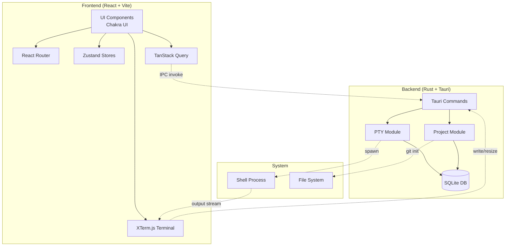

# Architecture

## System Overview

2code follows a **Tauri Desktop Architecture** with a clear separation between a React-based frontend and a Rust-based backend. The architecture emphasizes:

- **Process Isolation**: Frontend runs in a WebView, backend as native Rust code
- **IPC Communication**: All cross-boundary communication via Tauri's invoke system
- **Stateful Backend**: Rust manages PTY sessions and database state
- **Reactive Frontend**: React with TanStack Query for server state synchronization

## Architecture Diagram

## Component Map

### Frontend Components

| Component | Location | Responsibility |
|-----------|----------|----------------|
| `App` | `src/App.tsx` | Root layout with sidebar, routing, and terminal layer |
| `AppSidebar` | `src/components/AppSidebar.tsx` | Navigation sidebar with project list |
| `Terminal` | `src/components/Terminal.tsx` | XTerm.js terminal instance with PTY binding |
| `TerminalLayer` | `src/components/TerminalLayer.tsx` | Persistent terminal overlay across routes |
| `TerminalTabs` | `src/components/TerminalTabs.tsx` | Tab bar for multiple terminals per project |

### Backend Modules

| Module | Location | Responsibility |
|--------|----------|----------------|
| `lib` | `src-tauri/src/lib.rs` | Tauri app builder, command registration, lifecycle |
| `db` | `src-tauri/src/db.rs` | Database initialization, connection pool |
| `schema` | `src-tauri/src/schema.rs` | Diesel table definitions |
| `error` | `src-tauri/src/error.rs` | Error types and Result aliases |
| `project/commands` | `src-tauri/src/project/commands.rs` | Project CRUD Tauri commands |
| `project/models` | `src-tauri/src/project/models.rs` | Project Diesel models |
| `pty/commands` | `src-tauri/src/pty/commands.rs` | PTY Tauri commands |
| `pty/models` | `src-tauri/src/pty/models.rs` | PTY Diesel models |
| `pty/session` | `src-tauri/src/pty/session.rs` | PTY session management |

## State Management

### Frontend State (Zustand Stores)

| Store | Location | Purpose |
|-------|----------|---------|
| `terminalStore` | `src/stores/terminalStore.ts` | Active terminal tabs, visibility state, restore flags |
| `fontStore` | `src/stores/fontStore.ts` | User-selected terminal font family |

### Backend State (Rust)

| State | Type | Purpose |
|-------|------|---------|
| `PtySessionMap` | `Arc<Mutex<HashMap<String, PtySession>>>` | Active PTY sessions in memory |
| `DbPool` | `Arc<Mutex<SqliteConnection>>` | SQLite connection pool |

## Design Decisions

### 1. PTY Session Persistence
PTY sessions are stored in a managed HashMap in Rust with database-backed scrollback history. This allows terminals to survive page navigation while maintaining history across app restarts.

### 2. Terminal Layer Architecture
A persistent `TerminalLayer` component sits outside the route hierarchy, ensuring terminals remain mounted during navigation. Each project gets its own terminal instance managed by `TerminalTabs`.

### 3. Database Schema
Three main tables:
- `projects`: Project metadata (id, name, folder, created_at)
- `pty_sessions`: Session metadata (id, project_id, shell, cwd, created_at, closed_at)
- `pty_output_chunks`: Scrollback storage (session_id, data blob)

### 4. IPC Communication Pattern
All frontend-backend communication uses Tauri's invoke system:
- Commands are async and return Promises
- PTY output streams via Tauri events (`pty-output-{sessionId}`)
- Error handling uses AppError enum serialized to strings

### 5. CJK Project Name Support
Project folder names support CJK characters via pinyin transliteration, generating URL-safe slugs (e.g., "我的项目" → "wo-de-xiang-mu").
