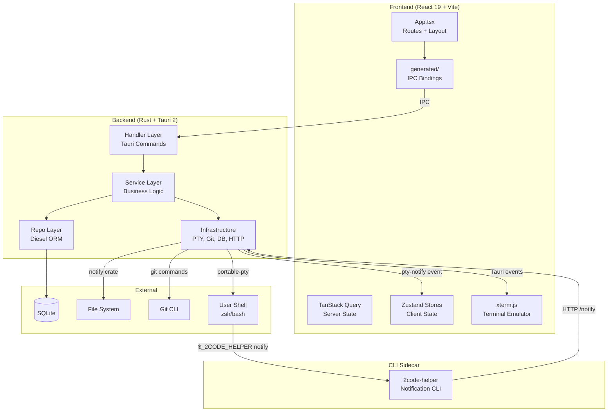

# Architecture

## Architecture Diagram



## Architecture Pattern

**Layered architecture** with 4 backend layers and a feature-based frontend. The backend enforces strict dependency direction: Handler → Service → Repo/Infrastructure. The frontend uses feature modules with co-located hooks, components, and stores.

## Backend Layers

### 1. Handler (`src-tauri/src/handler/`)

Tauri `#[tauri::command]` entry points. Extracts managed state (`DbPool`, `PtySessionMap`), acquires DB lock, delegates to service layer. No business logic.

| File         | Commands                                                                                                                                                                          |
| ------------ | --------------------------------------------------------------------------------------------------------------------------------------------------------------------------------- |
| `project.rs` | `create_project_temporary`, `create_project_from_folder`, `list_projects`, `update_project`, `delete_project`, `get_git_branch`, `get_git_diff`, `get_git_log`, `get_commit_diff` |
| `pty.rs`     | `create_pty_session`, `write_to_pty`, `resize_pty`, `close_pty_session`, `list_project_sessions`, `get_pty_session_history`, `delete_pty_session_record`                          |
| `profile.rs` | `create_profile`, `delete_profile`                                                                                                                                                |
| `watcher.rs` | `watch_projects`                                                                                                                                                                  |
| `font.rs`    | `list_system_fonts`                                                                                                                                                               |
| `sound.rs`   | `list_system_sounds`, `play_system_sound`                                                                                                                                         |
| `debug.rs`   | `start_debug_log`, `stop_debug_log`                                                                                                                                               |

### 2. Service (`src-tauri/src/service/`)

Business logic and orchestration. Coordinates between repo and infrastructure layers.

| File         | Responsibility                                                                                                         |
| ------------ | ---------------------------------------------------------------------------------------------------------------------- |
| `project.rs` | Project CRUD, git branch/diff/log resolution via context ID                                                            |
| `profile.rs` | Profile creation (git worktree + setup script), deletion (teardown + cleanup), branch name sanitization                |
| `pty.rs`     | Session lifecycle (create with env injection, read loop, persistence thread, UTF-8 boundary handling), session cleanup |
| `watcher.rs` | File system watch orchestration                                                                                        |

### 3. Repository (`src-tauri/src/repo/`)

Direct database access via Diesel ORM. Pure CRUD plus composite queries.

| File         | Responsibility                                                                             |
| ------------ | ------------------------------------------------------------------------------------------ |
| `project.rs` | Project CRUD, `resolve_context_folder()` (profile ID → worktree path, project ID → folder) |
| `profile.rs` | Profile CRUD, project folder lookup                                                        |
| `pty.rs`     | Session records, output chunk storage/retrieval/pruning                                    |

### 4. Infrastructure (`src-tauri/src/infra/`)

Cross-cutting concerns and external system integrations.

| File            | Responsibility                                                                                               |
| --------------- | ------------------------------------------------------------------------------------------------------------ |
| `db.rs`         | SQLite init, WAL + FK pragmas, embedded migrations. Type: `DbPool = Arc<Mutex<SqliteConnection>>`            |
| `pty.rs`        | PTY session map, `create_session()` / `write_to_pty()` / `resize_pty()` / `close_session()` via portable-pty |
| `git.rs`        | Git CLI execution: branch, diff, log, show. Commit parsing, shortstat parsing                                |
| `helper.rs`     | Axum HTTP server (ephemeral port) for sidecar communication. Routes: `/notify`, `/health`                    |
| `shell_init.rs` | Prepares ZDOTDIR temp directory with `.zshenv` for shell init script injection                               |
| `config.rs`     | Loads `2code.json` project config, executes setup/teardown scripts                                           |
| `slug.rs`       | CJK-aware slug generation (pinyin crate)                                                                     |
| `logger.rs`     | Tracing channel layer for debug log streaming                                                                |
| `watcher.rs`    | File system watching via `notify` crate, shutdown flag                                                       |

## Frontend Architecture

### Provider Stack (`src/main.tsx`)

```
QueryClientProvider → ChakraProvider → ThemeProvider → BrowserRouter → App
```

### Routing (`src/App.tsx`)

| Path                                | Component           |
| ----------------------------------- | ------------------- |
| `/`                                 | `HomePage`          |
| `/projects/:id/profiles/:profileId` | `ProjectDetailPage` |
| `/settings`                         | `SettingsPage`      |
| `*`                                 | Redirect to `/`     |

### State Management

| Store                 | Type              | Location                                            | Persistence                       |
| --------------------- | ----------------- | --------------------------------------------------- | --------------------------------- |
| Terminal tabs         | Zustand + immer   | `features/terminal/store.ts`                        | Rebuilt from DB on startup        |
| Terminal settings     | Zustand + persist | `features/settings/stores/terminalSettingsStore.ts` | localStorage                      |
| Notification settings | Zustand + persist | `features/settings/stores/notificationStore.ts`     | localStorage + tauri-plugin-store |
| Theme settings        | Zustand + persist | `features/settings/stores/themeStore.ts`            | localStorage                      |
| Debug panel           | Zustand           | `features/debug/debugStore.ts`                      | None                              |
| Debug logs            | Zustand           | `features/debug/debugLogStore.ts`                   | None                              |
| Server data           | TanStack Query    | `shared/lib/queryClient.ts`                         | None (refetched)                  |

### Terminal Architecture

Terminals never unmount. `TerminalLayer` (`features/terminal/TerminalLayer.tsx`) renders as a persistent absolute-positioned overlay. Tab switches use CSS `display: none` to preserve xterm.js state. Each terminal instance wraps xterm.js and communicates with the backend via Tauri events (`pty-output-{id}`, `pty-exit-{id}`).

## Workspace Crates

```
src-tauri/
├── Cargo.toml          # workspace root, members: ["shared", "2code-helper"]
├── shared/             # Shared types: NotifyResponse, NotificationEntry
└── 2code-helper/       # CLI sidecar binary (clap + ureq)
```

## Design Decisions

| Decision                                | Rationale                                                                                   |
| --------------------------------------- | ------------------------------------------------------------------------------------------- |
| Single SQLite connection (`Arc<Mutex>`) | Desktop app with single user; pool overhead unnecessary                                     |
| CSS display for terminal visibility     | xterm.js loses state on unmount; display toggle preserves it                                |
| tauri-typegen for IPC bindings          | Eliminates manual TS wrappers, type-safe end-to-end                                         |
| Sidecar for notifications               | Shell processes can't call Tauri IPC directly; HTTP bridge enables CLI → app communication  |
| ZDOTDIR injection for shell init        | Non-destructive way to inject init scripts into zsh without modifying user dotfiles         |
| immer `enableMapSet()`                  | Terminal store uses `Set<string>` for notification tracking; requires explicit immer plugin |
| Feature-based frontend structure        | Co-locates hooks, components, and stores per domain for cohesion                            |
