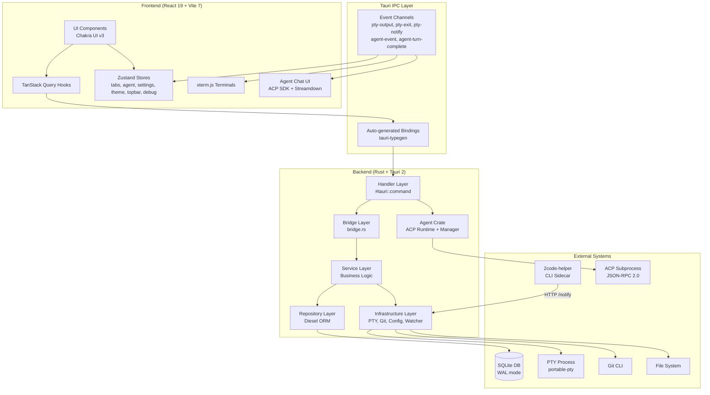
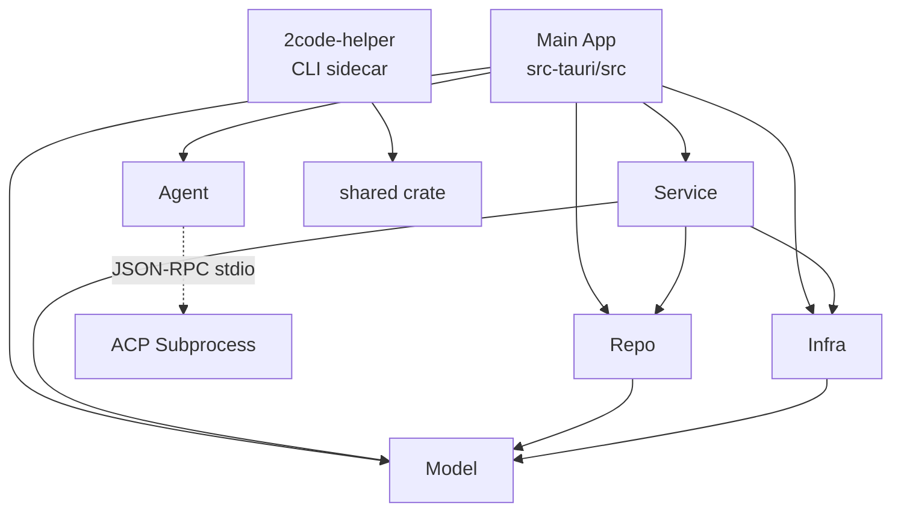

# Architecture

## Architecture Diagram

## Architecture Pattern

The project follows a **layered architecture** with **feature-based frontend organization**:

- **Frontend**: Feature modules (terminal, tabs, agent, projects, git, settings, topbar) each own their components, hooks, and stores. Shared utilities live in `shared/`. State is split between Zustand (client) and TanStack Query (server).
- **Backend**: 5 layers with strict dependency direction (Handler → Bridge → Service → Repo/Infra). The bridge layer implements dependency inversion — service traits define interfaces, bridge provides Tauri-specific implementations.

## Workspace Crate Dependency Graph

## Core Components

### Frontend

#### Tab System (`src/features/tabs/`)

- **Location**: `src/features/tabs/`
- **Responsibility**: Unified tab session abstraction supporting terminal and agent tabs with restoration
- **Key interfaces**: `useCreateTab()`, `useCloseTab()`, `useTabStore`, `sessionRegistry`, `restorationPromise`
- **Dependencies**: Zustand (immer), TanStack Query (QueryObserver), Tauri IPC, `TerminalTabSession`, `AgentTabSession`
- **Deep dive**: [Tab System](./components/tabs.md)

#### Terminal Feature (`src/features/terminal/`)

- **Location**: `src/features/terminal/`
- **Responsibility**: xterm.js terminal rendering, persistent overlay via `TerminalLayer`, theme management
- **Key interfaces**: `Terminal`, `TerminalLayer`, `TerminalTabs`, `useTerminalTheme()`
- **Dependencies**: xterm.js, Tauri events, tab store

#### Agent Feature (`src/features/agent/`)

- **Location**: `src/features/agent/`
- **Responsibility**: AI agent chat via ACP — session management, streaming UI, message rendering
- **Key interfaces**: `AgentChat`, `useAgentStore`, `useSendAgentPrompt()`, `AgentTabSession`
- **Dependencies**: ACP SDK, Streamdown, Shiki, Zustand (immer), Tauri events
- **Deep dive**: [Agent System](./components/agent.md)

#### Projects Feature (`src/features/projects/`)

- **Location**: `src/features/projects/`
- **Responsibility**: Project CRUD operations, detail page, folder/temporary project creation
- **Key interfaces**: `useProjects()`, `useCreateProject()`, `useDeleteProject()`, `ProjectDetailPage`
- **Dependencies**: TanStack Query, Tauri IPC

#### Git Feature (`src/features/git/`)

- **Location**: `src/features/git/`
- **Responsibility**: Git diff viewer, commit history browser with syntax highlighting, keyboard navigation
- **Key interfaces**: `useGitDiff()`, `useGitLog()`, `useCommitDiff()`, `GitDiffDialog`, `gitDiffReducer`
- **Dependencies**: @pierre/diffs, Shiki, TanStack Query, immer+ts-pattern reducer

#### Profiles Feature (`src/features/profiles/`)

- **Location**: `src/features/profiles/`
- **Responsibility**: Profile (git worktree) create/delete with setup/teardown scripts
- **Key interfaces**: `useCreateProfile()`, `useDeleteProfile()`
- **Dependencies**: TanStack Query, tab system (for cleanup)

#### Settings Feature (`src/features/settings/`)

- **Location**: `src/features/settings/`
- **Responsibility**: App settings (terminal font/theme, accent color, notifications, agents)
- **Key interfaces**: `terminalSettingsStore`, `themeStore`, `notificationStore`, `SettingsPage`
- **Dependencies**: Zustand (persisted), Chakra UI, Tauri plugin-store

#### Top Bar Feature (`src/features/topbar/`)

- **Location**: `src/features/topbar/`
- **Responsibility**: Customizable project top bar with drag-and-drop control ordering
- **Key interfaces**: `topBarStore`, `controlRegistry`, controls (git-diff, vscode, github-desktop, windsurf, cursor)
- **Dependencies**: @dnd-kit/core, @dnd-kit/sortable, Zustand, @tauri-apps/plugin-shell

#### Layout (`src/layout/`)

- **Location**: `src/layout/`
- **Responsibility**: App sidebar with project navigation, profile list, keyboard navigation
- **Key interfaces**: `AppSidebar`, `ProjectMenuItem`, `ProfileList`, `ProfileItem`
- **Dependencies**: react-router, tab store (notification dots)

#### Shared (`src/shared/`)

- **Location**: `src/shared/`
- **Responsibility**: Query client config, centralized query keys, theme provider, fallback components, hooks
- **Key interfaces**: `queryKeys`, `queryClient`, `ThemeProvider`, `PageSkeleton`, `PageError`, `useDialogState`, `tauriStorage`
- **Dependencies**: TanStack Query, next-themes, Chakra UI, Tauri plugin-store

### Backend

#### Handler (`src-tauri/src/handler/`)

- **Location**: `src-tauri/src/handler/`
- **Responsibility**: Tauri `#[tauri::command]` entry points — extract state, delegate to service
- **Key interfaces**: 33+ IPC commands across modules (pty, project, profile, font, sound, watcher, debug, agent)
- **Dependencies**: Tauri state extraction, service layer, agent crate

| Module | Commands |
|--------|----------|
| `project.rs` | `create_project_temporary`, `create_project_from_folder`, `list_projects`, `update_project`, `delete_project`, `get_git_branch`, `get_git_diff`, `get_git_log`, `get_commit_diff` |
| `pty.rs` | `create_pty_session`, `write_to_pty`, `resize_pty`, `close_pty_session`, `list_project_sessions`, `get_session_output`, `delete_pty_session_record`, `flush_pty_output` |
| `profile.rs` | `create_profile`, `delete_profile` |
| `agent.rs` | `list_agent_status`, `install_agent`, `detect_credentials`, `send_agent_prompt`, `close_agent_session`, `create_agent_session_persistent`, `reconnect_agent_session`, `list_project_agent_sessions`, `delete_agent_session_record`, `list_agent_session_events` |
| `watcher.rs` | `watch_projects` |
| `font.rs` | `list_system_fonts` |
| `sound.rs` | `list_system_sounds`, `play_system_sound` |
| `debug.rs` | `start_debug_log`, `stop_debug_log` |

#### Bridge (`src-tauri/src/bridge.rs`)

- **Location**: `src-tauri/src/bridge.rs`
- **Responsibility**: Adapts Tauri types to service-layer trait abstractions
- **Key interfaces**: `TauriPtyEmitter` (implements `PtyEventEmitter`), `TauriWatchSender` (implements `WatchEventSender`), `build_pty_context()`
- **Dependencies**: Tauri AppHandle, service traits

#### Service (`crates/service/`)

- **Location**: `src-tauri/crates/service/`
- **Responsibility**: Business logic orchestration — PTY lifecycle, project/profile CRUD, git operations, file watching
- **Key interfaces**: `pty::create_session()`, `project::create_temporary()`, `profile::create()`, `watcher::start()`
- **Dependencies**: repo, infra, model crates

#### Repository (`crates/repo/`)

- **Location**: `src-tauri/crates/repo/`
- **Responsibility**: Direct database access via Diesel ORM
- **Key interfaces**: `project::list_all_with_profiles()`, `project::resolve_context_folder()`, `profile::find_by_id()`, `pty::insert_session()`, `agent::insert_session()`, `agent::list_events()`
- **Dependencies**: model crate, Diesel

#### Infrastructure (`crates/infra/`)

- **Location**: `src-tauri/crates/infra/`
- **Responsibility**: Cross-cutting concerns — database setup, PTY spawning, git CLI, config loading, shell init, file watching, slug generation, logging, sidecar HTTP server
- **Dependencies**: model crate, portable-pty, notify, pinyin, diesel_migrations, axum

| Module | Responsibility |
|--------|---------------|
| `db.rs` | SQLite init, WAL + FK pragmas, embedded migrations. `DbPool = Arc<Mutex<SqliteConnection>>` |
| `pty.rs` | PTY session map, spawn/write/resize/close via portable-pty. 4KB read chunks with UTF-8 boundary detection |
| `git.rs` | Git CLI: branch, diff (temp index), log, show. Commit/shortstat parsing |
| `helper.rs` | Axum HTTP server (ephemeral port) for sidecar. Routes: `/notify`, `/health` |
| `shell_init.rs` | ZDOTDIR temp directory with `.zshenv` for shell init injection |
| `config.rs` | Loads `2code.json`, executes setup/teardown/init scripts |
| `slug.rs` | CJK-aware slug generation (pinyin crate) |
| `logger.rs` | Tracing channel layer for debug log streaming |
| `watcher.rs` | File system watching via `notify` crate, debounce, project reconciliation |

#### Model (`crates/model/`)

- **Location**: `src-tauri/crates/model/`
- **Responsibility**: Diesel models, database schema, DTOs, error types
- **Key interfaces**: `Project`, `Profile`, `PtySessionRecord`, `AgentSessionRecord`, `AgentSessionEventRecord`, `NewProject`, `AppError`
- **Dependencies**: Diesel, serde, thiserror

#### Agent (`crates/agent/`)

- **Location**: `src-tauri/crates/agent/`
- **Responsibility**: AI code assistant management via ACP (Agent Communication Protocol)
- **Sub-modules**: `manager.rs` (agent detection/installation), `runtime.rs` (JSON-RPC 2.0 stdio adapter for ACP sessions)
- **Key interfaces**: `AgentManagerWrapper::list_status()`, `AgentManagerWrapper::install()`, `AcpStdioAdapter::spawn()`, `AcpStdioAdapter::request()`, `AcpStdioAdapter::notify()`, `AcpStdioAdapter::shutdown()`
- **Dependencies**: rivet-dev/sandbox-agent, tokio, serde_json
- **Deep dive**: [Agent System](./components/agent.md)

## Key Design Decisions

| Decision | Rationale |
|----------|-----------|
| Single SQLite connection (`Arc<Mutex>`) | Desktop app with single user; pool overhead unnecessary. WAL mode handles concurrent reads. |
| Trait-based service layer | Decouples business logic from Tauri framework. Enables unit testing with mocks and framework portability. |
| CSS display for terminal visibility | xterm.js loses state on unmount; `display: none` toggle preserves scrollback, cursor, and alternate screen. |
| Bridge layer (dependency inversion) | Service layer defines `PtyEventEmitter`/`WatchEventSender` traits; bridge provides Tauri implementations. |
| Single BLOB PTY output | Atomic appends (`data = data \|\| ?`), built-in 1MB trim, simpler than chunked storage. |
| ZDOTDIR shell initialization | Non-destructive init script injection — one-shot `.zshenv` with `precmd` self-cleanup. |
| Temp git index for diff | `GIT_INDEX_FILE=/tmp/...` avoids modifying user's staging area while showing complete diff. |
| Profile-based session scoping | PTY/agent sessions belong to profiles (worktrees), not projects — ensures correct branch/directory context. |
| tauri-typegen codegen | Eliminates manual TypeScript IPC wrappers. Type-safe end-to-end with zero maintenance. |
| Unified tab abstraction | `TabSession` base class with `TerminalTabSession`/`AgentTabSession` — shared lifecycle, registry, and store. |
| ACP via stdio JSON-RPC | Subprocess communication over stdin/stdout allows language-agnostic agent spawning with structured messaging. |
| Feature-based frontend structure | Co-locates hooks, components, and stores per domain. Shared utilities in `shared/`. |
| Sidecar for shell notifications | PTY processes can't call Tauri IPC directly; HTTP bridge enables CLI → app notification flow. |
| ts-pattern exhaustive matching | Used in tab type dispatch, agent event handling, and git diff reducer for compile-time safety. |
