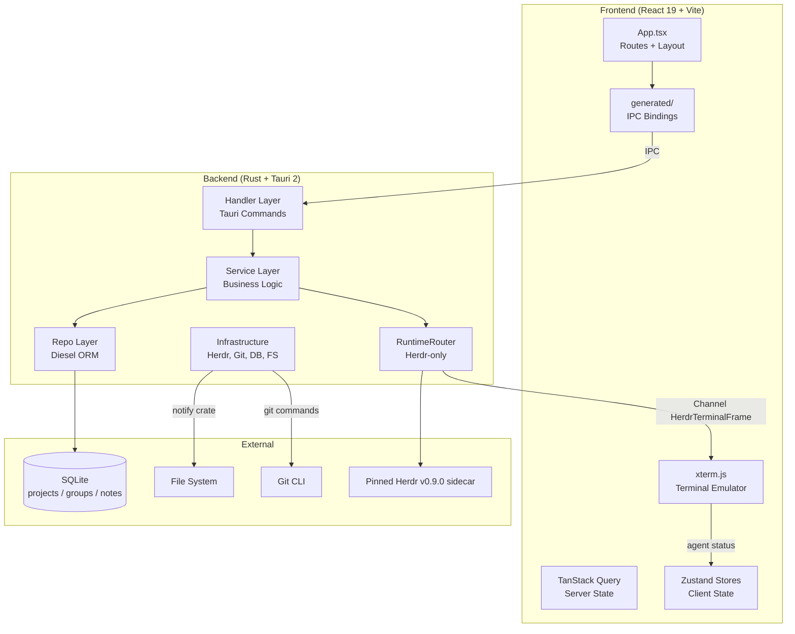

# Architecture

Herdr is the production runtime. sqlite `profiles` / `pty_sessions` and Local PTY are gone. Probe contract: [Herdr integration](herdr-integration.md).

## Architecture Diagram


```mermaid
graph TD
    subgraph Frontend ["Frontend (React 19 + Vite)"]
        App[App.tsx<br/>Routes + Layout]
        TQ[TanStack Query<br/>Server State]
        ZS[Zustand Stores<br/>Client State]
        XT[xterm.js<br/>Terminal Emulator]
        Gen[generated/<br/>IPC Bindings]
    end

    subgraph Backend ["Backend (Rust + Tauri 2)"]
        H[Handler Layer<br/>Tauri Commands]
        S[Service Layer<br/>Business Logic]
        R[Repo Layer<br/>Diesel ORM]
        I[Infrastructure<br/>Herdr, Git, DB, FS]
        RR[RuntimeRouter<br/>Herdr-only]
    end

    subgraph External ["External"]
        DB[(SQLite<br/>projects / groups / notes)]
        FS[File System]
        Git[Git CLI]
        Herdr[Pinned Herdr v0.9.0 sidecar]
    end

    App --> Gen
    Gen -->|IPC| H
    H --> S
    S --> R
    S --> RR
    RR --> Herdr
    R --> DB
    I -->|git commands| Git
    I -->|notify crate| FS
    RR -->|Channel HerdrTerminalFrame| XT
    XT -->|agent status| ZS
```

## Architecture Pattern

**Layered architecture** with 4 backend layers and a feature-based frontend. The backend enforces strict dependency direction: Handler → Service → Repo/Infrastructure. The frontend uses feature modules with co-located hooks, components, and stores. Session/profile/git paths go through Herdr-only `RuntimeRouter`; sqlite is the project catalog.

## Backend Layers

### 1. Handler (`src-tauri/src/handler/`)

Tauri `#[tauri::command]` entry points. Extracts managed state (`DbPool`, `RuntimeHandle`), acquires the DB lock only when sqlite is needed, delegates to the service layer. No business logic. Existing IPC names stay (`create_pty_session`, `create_profile`, `delete_project`, …).

| File         | Commands                                                                                                                                                                          |
| ------------ | --------------------------------------------------------------------------------------------------------------------------------------------------------------------------------- |
| `project.rs` | `create_project_from_folder`, `list_projects`, `update_project`, `delete_project`, git helpers (`get_git_branch`, `get_git_diff`, `get_git_log`, …) |
| `pty.rs`     | `create_pty_session`, `write_to_pty`, `resize_pty`, `scroll_pty`, `close_pty_session`, `list_project_sessions`, `attach_pty_output`, `stream_herdr_output`, `detach_pty_output` |
| `profile.rs` | `create_profile`, `delete_profile`, `get_profile_delete_check`, `update_profile_notes`                                                                                            |
| `watcher.rs` | `watch_projects`                                                                                                                                                                  |
| `font.rs`    | `list_system_fonts`                                                                                                                                                               |
| `sound.rs`   | `list_system_sounds`, `play_system_sound`                                                                                                                                         |
| `debug.rs`   | `start_debug_log`, `stop_debug_log`                                                                                                                                               |

`delete_project` is catalog-forget + retain: drop the sqlite `projects` row and release Herdr attachments without `pane.close` / `worktree.remove`.

### 2. Service (`src-tauri/crates/service/`)

Business logic and orchestration. Coordinates between repo, infrastructure, and Herdr.

| File              | Responsibility                                                                                                         |
| ----------------- | ---------------------------------------------------------------------------------------------------------------------- |
| `project.rs`      | Project CRUD; `list_with_runtime` / `adopt_existing_checkouts`; `reconcile_profile_checkout` (live Herdr cwd)          |
| `profile.rs`      | Create via Herdr `worktree.create` / `workspace.create`; delete via `worktree.remove` / `workspace.close`              |
| `runtime.rs`      | Herdr-only `RuntimeRouter` (create/list/close/write/resize; restore reattaches a live `pane_id`)                       |
| `runtime/herdr.rs`| Herdr adapter: `pane_id` sessions, frame stream, snapshot list                                                         |
| `runtime_sync.rs` | `HerdrRuntimeSync` started from GUI connect (`connect_gui_herdr`); `lib.rs` does not name it                           |
| `watcher.rs`      | File system watch orchestration from live checkout roots                                                               |

There is no `service::pty` Local spawn, no orphan-log GC, and no `TWOCODE_RUNTIME`.

### 3. Repository (`src-tauri/crates/repo/`)

Direct database access via Diesel ORM. Pure CRUD plus composite queries. sqlite tables: `projects`, `project_groups`, `checkout_notes`.

| File                | Responsibility                                                                             |
| ------------------- | ------------------------------------------------------------------------------------------ |
| `project.rs`        | Project CRUD                                                                               |
| `project_group.rs`  | Sidebar group CRUD                                                                         |
| `checkout_notes.rs` | Notes keyed by `project_id` + canonical checkout path                                      |

There is no repo `profile.rs` / `pty.rs`. Checkout paths for Git / the file tree come from live Herdr, not a sqlite `profiles` table.

### 4. Infrastructure (`src-tauri/crates/infra/`)

Cross-cutting concerns and external system integrations.

| File            | Responsibility                                                                                               |
| --------------- | ------------------------------------------------------------------------------------------------------------ |
| `db.rs`         | SQLite init, WAL + FK pragmas, embedded migrations. Type: `DbPool = Arc<Mutex<SqliteConnection>>`            |
| `herdr/`        | Pinned v0.9.0 sidecar resolve, dedicated `2code` namespace, NDJSON transport, CLI terminal attach            |
| `git.rs`        | Git CLI execution: branch, diff, log, show. Commit parsing, shortstat parsing                                |
| `filesystem.rs` | File-tree operations: list/rename/move/delete/create/search with worktree containment                        |
| `config.rs`     | Loads `2code.json` project config, executes setup/teardown scripts                                           |
| `no_window.rs`  | No-window label helper for startup/background flows                                                          |
| `slug.rs`       | CJK-aware slug generation (pinyin crate)                                                                     |
| `logger.rs`     | Tracing channel layer for debug log streaming                                                                |
| `watcher.rs`    | File system watching via `notify` crate, shutdown flag                                                       |

There is no `infra::pty` / `pty_log.rs` / `shell_init.rs`. Shell init is Herdr `init_script` / `startup_commands` after `tab.create`.

## Frontend Architecture

### Provider Stack (`src/main.tsx`)

```
QueryClientProvider → ThemeProvider → TooltipProvider → BrowserRouter → AppRoot
```

### Routing (`src/App.tsx`)

| Path                                | Component           |
| ----------------------------------- | ------------------- |
| `/`                                 | `HomePage`          |
| `/projects/:id/profiles/:profileId` | `ProjectDetailPage` |
| `/settings`                         | `SettingsPage`      |
| `*`                                 | Redirect to `/`     |

`profileId` in the route is a Herdr `workspace_id`.

### State Management

| Store                 | Type              | Location                                            | Persistence                       |
| --------------------- | ----------------- | --------------------------------------------------- | --------------------------------- |
| Terminal tabs         | Zustand + immer   | `features/terminal/store.ts`                        | Rebuilt from live Herdr panes     |
| Terminal settings     | Zustand + persist | `features/settings/stores/terminalSettingsStore.ts` | localStorage                      |
| Notification settings | Zustand + persist | `features/settings/stores/notificationStore.ts`     | localStorage + tauri-plugin-store |
| Theme settings        | Zustand + persist | `features/settings/stores/themeStore.ts`            | localStorage                      |
| Debug panel           | Zustand           | `features/debug/debugStore.ts`                      | None                              |
| Debug logs            | Zustand           | `features/debug/debugLogStore.ts`                   | None                              |
| Server data           | TanStack Query    | `shared/lib/queryClient.ts`                         | None (refetched)                  |

### Terminal Architecture

Terminals never unmount. `TerminalLayer` (`features/terminal/TerminalLayer.tsx`) renders as a persistent absolute-positioned overlay. Tab switches use CSS `display: none` to preserve xterm.js state. Each terminal instance wraps xterm.js and receives live Herdr frames over `stream_herdr_output` (`Channel<HerdrTerminalFrame>`). Tab ids are live `pane_id`s.

## Workspace Crates

```
src-tauri/
├── Cargo.toml          # workspace root
├── crates/
│   ├── infra/          # DB, Herdr sidecar/transport, git, filesystem, watcher, config
│   ├── model/          # DTOs, Diesel models, error types
│   ├── repo/           # Diesel repositories (projects, groups, checkout_notes)
│   └── service/        # Business logic + Herdr-only RuntimeRouter
└── src/                # Tauri app shell, handlers, bridge implementations
```

## Design Decisions

| Decision                                | Rationale                                                                                   |
| --------------------------------------- | ------------------------------------------------------------------------------------------- |
| Single SQLite connection (`Arc<Mutex>`) | Desktop app with single user; pool overhead unnecessary                                     |
| sqlite `projects` stay in 2code         | Project catalog is 2code-owned; Herdr is the profile/session authority                      |
| Herdr-only `RuntimeRouter`              | Local PTY / `TWOCODE_RUNTIME` deleted; fail closed if the sidecar is absent                 |
| CSS display for terminal visibility     | xterm.js loses state on unmount; display toggle preserves it                                |
| tauri-typegen for IPC bindings          | Eliminates manual TS wrappers, type-safe end-to-end                                         |
| Frontend-driven agent notifications     | Terminal output detection owns running/waiting state; waiting transitions can play the configured system sound |
| Feature-based frontend structure        | Co-locates hooks, components, and stores per domain for cohesion                            |
