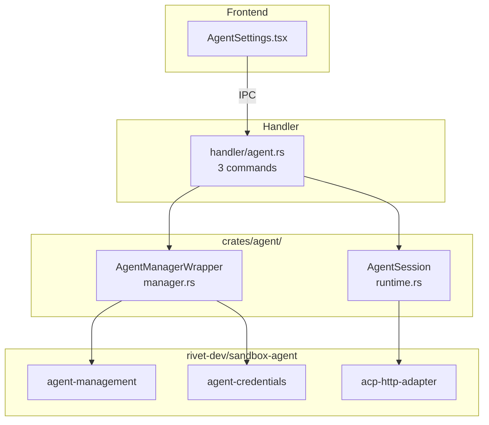

# Agent System

The agent system integrates AI code assistants via ACP (Agent Communication Protocol), enabling 2code to manage, install, and communicate with multiple AI agents.

## Overview

The agent crate (`crates/agent/`) wraps the [rivet-dev/sandbox-agent](https://github.com/rivet-dev/sandbox-agent) project to provide:

- **Manager**: Agent discovery, installation, and credential detection
- **Runtime**: HTTP-based JSON-RPC 2.0 sessions for agent communication

## Supported Agents

| Agent | ID | Native CLI Required |
|-------|----|-------------------|
| Claude Code | `claude` | Yes (`claude`) |
| Codex | `codex` | Yes (`codex`) |
| OpenCode | `opencode` | Yes (`opencode`) |
| Amp | `amp` | Yes (`amp`) |
| Pi | `pi` | No |
| Cursor | `cursor` | Yes (`cursor`) |

The Mock agent is filtered from the public API.

## Architecture



## Manager (`manager.rs`)

### AgentManagerWrapper

Wraps `sandbox_agent_agent_management::AgentManager`. Initialized at app startup with install directory at `~/.cache/2code/agents` (fallback: `/tmp/2code/agents`).

### `list_status() -> Vec<AgentStatusInfo>`

Returns installation status for all agents:

```rust
AgentStatusInfo {
    id: String,              // "claude", "codex", "amp", etc.
    display_name: String,    // "Claude Code", "Codex", etc.
    native_required: bool,   // Whether the native CLI must be installed
    native_installed: bool,  // Whether the native CLI is found on system
    native_version: Option<String>,
    acp_installed: bool,     // Whether the ACP bridge binary is installed
    acp_version: Option<String>,
    ready: bool,             // Both native (if required) and ACP are installed
}
```

### `install(agent_str: &str) -> Result<()>`

Installs the ACP bridge binary for a given agent. May also install native dependencies. Runs as a blocking operation (offloaded to thread pool in handler).

### `detect_credentials() -> CredentialInfo`

Scans the system for AI provider credentials:

```rust
CredentialInfo {
    anthropic: Option<CredentialEntry>,
    openai: Option<CredentialEntry>,
}

CredentialEntry {
    source: String,      // "environment", "config", "keychain"
    provider: String,    // "anthropic", "openai"
    auth_type: String,   // "api_key", "oauth"
    key_preview: String, // "sk-a...7890" (first 4 + last 4 chars)
}
```

Checks environment variables, config files (`.zshrc`, `.env`), and system credential stores.

## Runtime (`runtime.rs`)

### AgentSession

Manages a running ACP agent process:

```rust
pub struct AgentSession {
    pub id: String,           // UUID
    pub agent: String,        // Agent identifier
    pub cwd: PathBuf,         // Working directory
    runtime: Arc<AdapterRuntime>,  // acp-http-adapter
    request_id: AtomicU64,    // Monotonic JSON-RPC request ID
}
```

### `spawn(agent, cwd, env) -> Result<AgentSession>`

Starts an ACP agent process:
1. Resolve agent binary from `AgentManager`
2. Set environment variables (working directory, credentials)
3. Launch process via `acp-http-adapter`
4. Return session handle

### `send(method, params) -> Result<Value>`

JSON-RPC 2.0 request/response:
1. Increment atomic request ID
2. Send JSON-RPC request via HTTP adapter
3. Wait for response
4. Return result or propagate error

### `notify(method, params) -> Result<()>`

JSON-RPC 2.0 notification (fire-and-forget):
1. Send notification via HTTP adapter
2. No response expected

### `notifications() -> Stream<Value>`

Returns a stream of push notifications from the agent process. Used for progress updates, tool calls, and other agent-initiated messages.

### `shutdown() -> Result<()>`

Graceful process termination:
1. Send shutdown signal via adapter
2. Wait for process to exit
3. Clean up resources

## Frontend Integration

### AgentSettings (`src/features/settings/AgentSettings.tsx`)

Settings page tab that displays:

1. **Agent Status Cards** — For each agent:
   - Display name and installation status
   - Native CLI status (installed version or "not found")
   - ACP bridge status (installed version or "not installed")
   - Ready indicator (green when both native + ACP are installed)
   - Install/Reinstall button

2. **Credential Detection** — Shows detected API keys:
   - Provider badge (Anthropic / OpenAI)
   - Auth type badge (API Key / OAuth)
   - Source indicator (environment, config, keychain)
   - Masked key preview

### Hooks

```typescript
// Query: fetch agent installation status
const { data } = useSuspenseQuery({
  queryKey: queryKeys.agent.status(),
  queryFn: listAgentStatus
})

// Query: detect credentials
const { data } = useSuspenseQuery({
  queryKey: queryKeys.agent.credentials(),
  queryFn: detectCredentials
})

// Mutation: install agent
const install = useMutation({
  mutationFn: (agent: string) => installAgent({ agent }),
  onSuccess: () => queryClient.invalidateQueries({ queryKey: queryKeys.agent.status() })
})
```

## Dependencies

| Crate | Source | Purpose |
|-------|--------|---------|
| `sandbox-agent-agent-management` | GitHub (rivet-dev) | Agent lifecycle (install, launch, status) |
| `acp-http-adapter` | GitHub (rivet-dev) | HTTP adapter for ACP process communication |
| `sandbox-agent-agent-credentials` | GitHub (rivet-dev) | Credential scanning and detection |
| `tokio` | crates.io | Async runtime (sync, time, process) |
| `serde` / `serde_json` | crates.io | JSON serialization for JSON-RPC |
| `uuid` | crates.io | Session ID generation |
| `futures` | crates.io | Stream handling for notifications |
