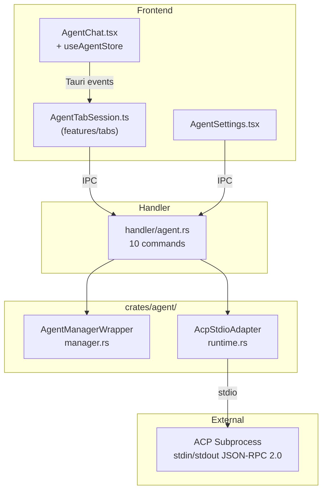

# Agent System

The agent system integrates AI code assistants via ACP (Agent Communication Protocol), enabling 2code to manage, install, and communicate with multiple AI agents.

## Overview

The agent crate (`crates/agent/`) wraps the [rivet-dev/sandbox-agent](https://github.com/rivet-dev/sandbox-agent) project to provide:

- **Manager**: Agent discovery, installation, and credential detection
- **Runtime**: HTTP-based JSON-RPC 2.0 sessions for agent communication

## Supported Agents

| Agent | ID | Native CLI Required |
|-------|----|-------------------|
| Claude Code | `claude` | Yes (`claude`) |
| Codex | `codex` | Yes (`codex`) |
| OpenCode | `opencode` | Yes (`opencode`) |
| Amp | `amp` | Yes (`amp`) |
| Pi | `pi` | No |
| Cursor | `cursor` | Yes (`cursor`) |

The Mock agent is filtered from the public API.

## Architecture



## Manager (`manager.rs`)

### AgentManagerWrapper

Wraps `sandbox_agent_agent_management::AgentManager`. Initialized at app startup with install directory at `~/.cache/2code/agents` (fallback: `/tmp/2code/agents`).

### `list_status() -> Vec<AgentStatusInfo>`

Returns installation status for all agents:

```rust
AgentStatusInfo {
    id: String,              // "claude", "codex", "amp", etc.
    display_name: String,    // "Claude Code", "Codex", etc.
    native_required: bool,   // Whether the native CLI must be installed
    native_installed: bool,  // Whether the native CLI is found on system
    native_version: Option<String>,
    acp_installed: bool,     // Whether the ACP bridge binary is installed
    acp_version: Option<String>,
    ready: bool,             // Both native (if required) and ACP are installed
}
```

### `install(agent_str: &str) -> Result<()>`

Installs the ACP bridge binary for a given agent. May also install native dependencies. Runs as a blocking operation (offloaded to thread pool in handler).

### `detect_credentials() -> CredentialInfo`

Scans the system for AI provider credentials:

```rust
CredentialInfo {
    anthropic: Option<CredentialEntry>,
    openai: Option<CredentialEntry>,
}

CredentialEntry {
    source: String,      // "environment", "config", "keychain"
    provider: String,    // "anthropic", "openai"
    auth_type: String,   // "api_key", "oauth"
    key_preview: String, // "sk-a...7890" (first 4 + last 4 chars)
}
```

Checks environment variables, config files (`.zshrc`, `.env`), and system credential stores.

## Runtime (`runtime.rs`)

### AcpStdioAdapter

Manages communication with ACP subprocesses via stdin/stdout JSON-RPC 2.0:

```rust
pub struct AcpStdioAdapter {
    stdin: Arc<Mutex<ChildStdin>>,
    child: Arc<Mutex<Child>>,
    pending: Arc<Mutex<HashMap<String, oneshot::Sender<Value>>>>,
    notification_tx: broadcast::Sender<Value>,
    shutting_down: Arc<AtomicBool>,
    request_id: AtomicU64,
    request_timeout: Option<Duration>,
}
```

### `spawn(binary, args, env, timeout) -> Result<AcpStdioAdapter>`

Starts an ACP subprocess:
1. Spawn child process with `stdin`/`stdout` piped, `stderr` inherited
2. Start background stdout reader task (dispatches responses and notifications)
3. Return adapter handle

### `request(method, params) -> Result<Value>`

JSON-RPC 2.0 request/response:
1. Increment atomic request ID
2. Create oneshot response channel and register in `pending` map
3. Write JSON-RPC request to subprocess stdin (newline-delimited)
4. Wait for response (with optional timeout)
5. On timeout or channel drop: clean up pending entry

### `notify(method, params) -> Result<()>`

JSON-RPC 2.0 notification (fire-and-forget):
1. Write notification to subprocess stdin
2. No response expected (no `id` field)

### `notifications() -> Stream<Value>`

Returns a `BroadcastStream` of push notifications from the subprocess. The stdout reader task dispatches messages without an `id` field to this broadcast channel.

### `shutdown()`

Graceful process termination:
1. Set `shutting_down` flag (prevents new requests)
2. Clear all pending requests
3. Kill subprocess and wait for exit

## Frontend Chat System

### AgentChat (`src/features/agent/AgentChat.tsx`)

Main chat component rendered inside `TerminalTabs` for agent-type tabs:

- **Lazy reconnection**: When `isActive && needsReconnection(sessionId)`, renders `AwaitReconnection` which calls `use(getReconnectPromise(sessionId))` — suspending until `AgentTabSession.reconnect()` resolves
- **Normal state**: Renders `MessageList` + `ChatInput`

### useAgentStore (`src/features/agent/store.ts`)

Zustand store (immer middleware) for agent session state:

```typescript
interface AgentSessionState {
  turns: AgentTurn[]           // Completed turns
  isStreaming: boolean         // Currently receiving a response
  streamingTurn: StreamingTurn | null  // In-progress turn
  error: string | null
}
```

**Key actions:**
- `handleAgentEvent(sessionId, event)` — Uses `ts-pattern` exhaustive match on ACP event types: `agent_message_chunk`, `agent_thought_chunk`, `tool_call`, `tool_call_update`, `plan`
- `handleTurnComplete(sessionId)` — Moves `streamingTurn` → `turns`, clears streaming state
- `restoreFromEvents(sessionId, events)` — Reconstructs conversation history by grouping `AgentSessionEventRecord[]` by `turn_index` and replaying them

### AgentTabSession (`src/features/tabs/AgentTabSession.ts`)

Extends `TabSession` base class:
- `static create()` — Calls `createAgentSessionPersistent`, registers Tauri event listeners
- `reconnect()` — Calls `reconnectAgentSession`, loads events from DB, restores store state
- `registerListeners()` — Subscribes to `agent-event-{id}`, `agent-turn-complete-{id}`, `agent-error-{id}`
- `close()` — Unlistens all events, calls `closeAgentSession` + `deleteAgentSessionRecord`

### Message UI Components

| Component | Responsibility |
|-----------|---------------|
| `MessageList` | Scrollable message container |
| `MessageBubble` | User message display |
| `StreamingBubble` | In-progress agent response |
| `TurnRenderer` | Dispatches content blocks for a completed turn |
| `StreamingTurnRenderer` | Dispatches content blocks for streaming turn |
| `AgentResponseGroup` | Groups agent content blocks visually |
| `ThoughtBlock` | Agent thinking/reasoning display |
| `PlanBlock` | Agent plan display |
| `ToolCallBlock` | Tool call with status indicator |
| `ToolCallContentRenderer` | Renders tool call results (diff, file locations) |
| `DiffRenderer` | Syntax-highlighted diff display (Shiki) |
| `MarkdownRenderer` | Markdown rendering via Streamdown |
| `ChatInput` | Text input with submit handling |
| `StatusBadge` | Streaming/error status indicator |

## Frontend Settings

### AgentSettings (`src/features/settings/AgentSettings.tsx`)

Settings page tab that displays:

1. **Agent Status Cards** — For each agent:
   - Display name and installation status
   - Native CLI status (installed version or "not found")
   - ACP bridge status (installed version or "not installed")
   - Ready indicator (green when both native + ACP are installed)
   - Install/Reinstall button

2. **Credential Detection** — Shows detected API keys:
   - Provider badge (Anthropic / OpenAI)
   - Auth type badge (API Key / OAuth)
   - Source indicator (environment, config, keychain)
   - Masked key preview

### Hooks

```typescript
// Query: fetch agent installation status
const { data } = useSuspenseQuery({
  queryKey: queryKeys.agent.status(),
  queryFn: listAgentStatus
})

// Query: detect credentials
const { data } = useSuspenseQuery({
  queryKey: queryKeys.agent.credentials(),
  queryFn: detectCredentials
})

// Mutation: install agent
const install = useMutation({
  mutationFn: (agent: string) => installAgent({ agent }),
  onSuccess: () => queryClient.invalidateQueries({ queryKey: queryKeys.agent.status() })
})
```

## Dependencies

| Crate | Source | Purpose |
|-------|--------|---------|
| `sandbox-agent-agent-management` | GitHub (rivet-dev) | Agent lifecycle (install, launch, status) |
| `acp-http-adapter` | GitHub (rivet-dev) | HTTP adapter for ACP process communication |
| `sandbox-agent-agent-credentials` | GitHub (rivet-dev) | Credential scanning and detection |
| `tokio` | crates.io | Async runtime (sync, time, process) |
| `serde` / `serde_json` | crates.io | JSON serialization for JSON-RPC |
| `uuid` | crates.io | Session ID generation |
| `futures` | crates.io | Stream handling for notifications |
