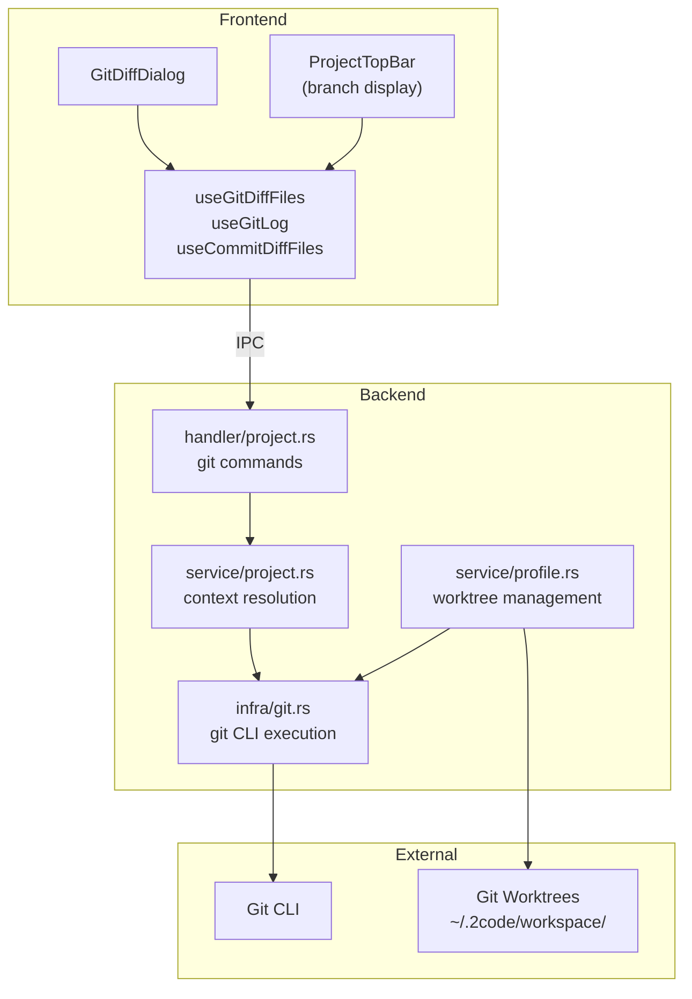

# Git Integration

Git integration in 2code provides diff viewing, commit history browsing, and branch-isolated workspaces via git worktrees.

## Architecture



## Temp Index Diff Strategy

The diff command (`get_git_diff`) uses a temporary git index to avoid modifying the user's staging area:

```bash
# Create temp index
GIT_INDEX_FILE=/tmp/2code-diff-{uuid} git add -A

# Generate diff against HEAD using temp index
GIT_INDEX_FILE=/tmp/2code-diff-{uuid} git diff --cached HEAD

# Clean up temp index
rm /tmp/2code-diff-{uuid}
```

**Why not `git diff HEAD`?** — `git diff HEAD` only shows unstaged changes. `git diff --cached HEAD` with a full `git add -A` shows the complete picture (staged + unstaged + untracked) without side effects.

**Implementation** (`infra/git.rs`):
1. Create temp file path for index
2. Run `git add -A` with `GIT_INDEX_FILE` env var
3. Run `git diff --cached HEAD` with same env var
4. Return unified diff output
5. Temp file cleaned up automatically

## Git Log Parser

The `get_git_log` command parses a custom format string:

```bash
git log --format="COMMIT_START%n%H%n%h%n%s%n%b%nAUTHOR_START%n%an%n%ae%nAUTHOR_END%nCOMMIT_END" --shortstat -n {limit}
```

**Parsed fields:**
- `%H` — Full hash
- `%h` — Short hash
- `%s` — Subject (first line)
- `%b` — Body (remaining lines)
- `%an` — Author name
- `%ae` — Author email
- `--shortstat` — Files changed, insertions, deletions

The parser uses delimiter-based splitting (`COMMIT_START`, `AUTHOR_START`, etc.) to handle multi-line commit bodies. Shortstat is parsed with regex to extract numeric values.

## Commit Hash Validation

Before executing `git show`, commit hashes are validated:

```rust
fn validate_commit_hash(hash: &str) -> Result<(), AppError> {
    if hash.len() < 4 || hash.len() > 40 { return Err(AppError::Git("invalid hash length")); }
    if !hash.chars().all(|c| c.is_ascii_hexdigit()) { return Err(AppError::Git("invalid characters")); }
    Ok(())
}
```

This prevents command injection via the commit hash parameter.

## Context ID Resolution

Git operations accept a `profile_id` that resolves polymorphically:

```
get_git_diff(profile_id)
    → repo::profile::find_by_id(profile_id)
        → profile.worktree_path (for non-default profiles)
        → profile → project.folder (for default profiles)
    → infra::git::diff(resolved_path)
```

This lets the same IPC commands work seamlessly with both:
- **Default profile** — Uses the project's root folder
- **Non-default profiles** — Uses the profile's worktree path at `~/.2code/workspace/{profile_id}`

## Worktree Profile System

### Creation Flow (`service/profile.rs`)

1. **Branch name sanitization** (`infra/slug.rs`):
   - CJK characters → pinyin romanization (`我的分支` → `wo-de-fen-zhi`)
   - Special characters stripped
   - Spaces → hyphens

2. **Worktree creation**:
   ```bash
   git worktree add ~/.2code/workspace/{profile_id} -b {sanitized_branch}
   ```

3. **Conflict resolution**: If the branch name conflicts with an existing ref (e.g., creating `feat/auth` when `feat` branch exists):
   - Parse stderr for conflicting ref name
   - Delete conflicting branch: `git branch -D {conflicting_ref}`
   - Retry worktree creation once

4. **Database**: Insert profile record with `is_default: false`

5. **Setup script**: If `2code.json` has `setup_script`, execute each command in the worktree directory

### Deletion Flow (`service/profile.rs`)

1. **Teardown script**: If `2code.json` has `teardown_script`, execute in worktree directory
2. **Database**: Delete profile record (cascades to sessions and output)
3. **Worktree removal**: `git worktree remove {worktree_path} --force`
4. **Branch cleanup**: `git branch -D {branch_name}`

### Default Profile

Every project gets an auto-created default profile:
- `is_default: true`
- `worktree_path` = project's root folder
- `branch_name` = detected current branch (or "main")
- Cannot be deleted

## Frontend Components

### GitDiffDialog (`src/features/git/GitDiffDialog.tsx`)

Full-screen dialog with two tabs:

**Changes Tab:**
- Shows working tree diff (staged + unstaged)
- File list sidebar with change indicators (+/-/~)
- Unified diff view with syntax highlighting via Shiki
- Auto-refreshes on file watcher events

**History Tab:**
- Commit list with author, date, and stats
- Drill into commit → shows that commit's file changes
- Keyboard navigation: Arrow keys, Enter (drill in), Backspace/Esc (back)

**State management** (`gitDiffReducer.ts`):
- Reducer pattern for complex UI state
- Tracks selected file index, active tab, drill-down state
- Uses React 19 `Activity` component for conditional rendering

### ProjectTopBar (`src/features/git/ProjectTopBar.tsx`)

Displays in the terminal area above tabs:
- Project name
- Git branch name (for default profile: reads from git; for non-default: shows profile branch name)
- Customizable controls from `topBarStore` (git diff button, VS Code, GitHub Desktop)

### Hooks

```typescript
// Fetch and parse working tree diff
useGitDiffFiles(profileId) → useSuspenseQuery({
  queryKey: queryKeys.git.diff(profileId),
  queryFn: () => getGitDiff({ profileId }).then(parsePatchFiles)
})

// Fetch commit history
useGitLog(profileId) → useSuspenseQuery({
  queryKey: queryKeys.git.log(profileId),
  queryFn: () => getGitLog({ profileId })
})

// Fetch diff for specific commit
useCommitDiffFiles(profileId, hash) → useSuspenseQuery({
  queryKey: queryKeys.git.commitDiff(profileId, hash),
  queryFn: () => getCommitDiff({ profileId, commitHash: hash }).then(parsePatchFiles)
})
```

Diff parsing uses `@pierre/diffs` (`parsePatchFiles`). Syntax highlighting maps terminal theme to Shiki theme.

## File Watcher Integration

The file system watcher (`features/watcher/fileWatcher.ts`) invalidates git-related queries on file changes:

```typescript
channel.onmessage = () => {
  queryClient.invalidateQueries({ queryKey: ["git-diff"], exact: false })
  queryClient.invalidateQueries({ queryKey: ["git-log"], exact: false })
}
```

Backend watcher debounces events at 500ms per project and skips changes inside `.git` directories.
