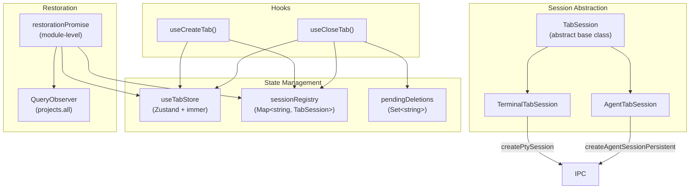

# Tab System

The tab system provides a unified abstraction for managing terminal and agent tabs, including session lifecycle, persistent storage, and app-startup restoration.

## Overview



## File Structure

```
src/features/tabs/
├── types.ts              # TerminalTab, AgentTab, ProfileTab (discriminated union)
├── session.ts            # Abstract TabSession base class
├── TerminalTabSession.ts # Terminal-specific session lifecycle
├── AgentTabSession.ts    # Agent-specific session lifecycle
├── store.ts              # useTabStore (Zustand + immer)
├── sessionRegistry.ts    # Module-level Map<string, TabSession>
├── pendingDeletions.ts   # Module-level Set<string> for close race prevention
├── restore.ts            # App-startup restoration pipeline
├── hooks.ts              # useCreateTab(), useCloseTab()
└── utils.ts              # closeAllTabsForProfile(), closeAllTabsForProfiles()
```

## Tab Types

```typescript
type TerminalTab = {
  type: "terminal"
  sessionId: string
  profileId: string
  title: string
}

type AgentTab = {
  type: "agent"
  sessionId: string
  profileId: string
  agent: string
  title: string
}

type ProfileTab = TerminalTab | AgentTab
```

The discriminated union on `type` enables exhaustive pattern matching with `ts-pattern` throughout the codebase.

## Session Abstraction

### TabSession (Base Class)

```typescript
abstract class TabSession {
  id: string
  profileId: string
  title: string

  abstract close(): Promise<void>
  abstract toTab(): ProfileTab
}
```

### TerminalTabSession

- **`static create(profileId, cwd)`** — Calls `createPtySession({ meta, config })` via IPC. Returns a new `TerminalTabSession` instance.
- **`close()`** — Calls `closePtySession` and `deletePtySessionRecord` in parallel.
- **`toTab()`** — Returns `TerminalTab { type: "terminal", sessionId, profileId, title }`.

### AgentTabSession

- **`static create(profileId, agent)`** — Calls `createAgentSessionPersistent({ meta })` via IPC. Spawns ACP subprocess. Calls `registerListeners()` to subscribe to Tauri events. Initializes `useAgentStore` session state.
- **`reconnect()`** — Called lazily when an agent tab is focused after restoration. Calls `reconnectAgentSession` to respawn the ACP subprocess, loads all `AgentSessionEventRecord` from DB, calls `useAgentStore.restoreFromEvents()` to reconstruct conversation history, and re-registers Tauri event listeners.
- **`registerListeners()`** — Subscribes to three Tauri events:
  - `agent-event-{id}` → `useAgentStore.handleAgentEvent()`
  - `agent-turn-complete-{id}` → `useAgentStore.handleTurnComplete()`
  - `agent-error-{id}` → `useAgentStore.handleError()`
- **`close()`** — Unlistens all events, calls `closeAgentSession` + `deleteAgentSessionRecord` in parallel, removes session from `useAgentStore`.

## Store (`useTabStore`)

Zustand store with immer middleware:

```typescript
interface ProfileTabState {
  tabs: ProfileTab[]
  activeTabId: string | null
}

interface TabStoreState {
  profiles: Record<string, ProfileTabState>
  notifiedTabs: Set<string>
}
```

**Actions:**
- `addTab(profileId, tab)` — Adds tab and sets it active
- `closeTab(profileId, sessionId)` — Removes tab, selects next active
- `setActiveTab(profileId, sessionId)` — Sets active tab
- `removeProfile(profileId)` — Removes entire profile state
- `updateTabTitle(sessionId, title)` — Updates tab title
- `replaceTab(sessionId, newTab)` — Replaces a tab in-place (used during restoration)
- `removeStaleProfiles(validProfileIds)` — Removes profiles not in the valid set
- `markNotified(sessionId)` — Adds to `notifiedTabs` set
- `markRead(sessionId)` — Removes from `notifiedTabs` set

**Module-level side effect:** Registers a Tauri event listener for `pty-notify` → calls `markNotified(sessionId)`.

**Selectors:**
- `useTabProfileIds()` — Returns `string[]` of profile IDs that have tabs
- `useProfileHasNotification(profileId)` — Returns `boolean` for notification dot display

## Session Registry

Module-level `Map<string, TabSession>`:

```typescript
const sessionRegistry = new Map<string, TabSession>()
```

All active session objects (both `TerminalTabSession` and `AgentTabSession`) are registered here. The registry enables:
- Looking up session objects by ID for close operations
- Iterating sessions for bulk operations (e.g., `closeAllTabsForProfile`)
- Providing `AgentTabSession` instances for lazy reconnection

## Pending Deletions

Module-level `Set<string>` that prevents double-close race conditions:

```typescript
export function markPending(id: string): boolean  // Returns false if already pending
export function clearPending(id: string): void
export function isPending(id: string): boolean
```

The `useCloseTab` hook calls `markPending` atomically before initiating close. If the tab is already being closed, the operation is skipped.

## Hooks

### useCreateTab

TanStack Query mutation:

```typescript
useMutation({
  mutationFn: async (params: { type: "terminal" | "agent", profileId, ... }) => {
    const session = match(params)
      .with({ type: "terminal" }, () => TerminalTabSession.create(...))
      .with({ type: "agent" }, () => AgentTabSession.create(...))
      .exhaustive()

    sessionRegistry.set(session.id, session)
    useTabStore.getState().addTab(profileId, session.toTab())
  }
})
```

### useCloseTab

TanStack Query mutation:

```typescript
useMutation({
  mutationFn: async ({ profileId, sessionId }) => {
    if (!markPending(sessionId)) return  // Already closing
    const session = sessionRegistry.get(sessionId)
    await session.close()
  },
  onSettled: (_, __, { profileId, sessionId }) => {
    sessionRegistry.delete(sessionId)
    useTabStore.getState().closeTab(profileId, sessionId)
    clearPending(sessionId)
  }
})
```

## Restoration Pipeline

The `restore.ts` module creates a module-level `restorationPromise` that runs once on app startup:

### Flow

1. **Wait for project data** — A `QueryObserver` watches `queryKeys.projects.all`. Once data is available, restoration begins.

2. **Clean stale profiles** — `removeStaleProfiles()` removes profiles from the Zustand store that no longer exist in the database.

3. **Fetch sessions per project** — For each project, fetches:
   - `listProjectSessions(projectId)` → `PtySessionRecord[]`
   - `listProjectAgentSessions(projectId)` → `AgentSessionRecord[]`

4. **Populate terminal tabs** — For each PTY session, creates a `TerminalTabSession` (without spawning a new PTY process — the original session record is used for display). Adds to `sessionRegistry` and `useTabStore`.

5. **Populate agent tabs** — For each agent session, creates an `AgentTabSession` (without reconnecting — reconnection happens lazily when the tab is focused). Adds to `sessionRegistry` and `useTabStore`.

6. **Promise resolves** — `TerminalLayer` renders via React 19 `use(restorationPromise)` Suspense integration.

### Lazy Agent Reconnection

Agent tabs restored from the database don't immediately spawn ACP subprocesses. Instead, `AgentChat` checks if the session needs reconnection when the tab becomes active:

```
User focuses agent tab
  → AgentChat renders AwaitReconnection
    → use(getReconnectPromise(sessionId)) suspends
      → AgentTabSession.reconnect() runs
        → reconnectAgentSession IPC call
        → Load events from DB
        → restoreFromEvents() on store
      → Promise resolves
    → AgentChat renders MessageList + ChatInput
```

## Utility Functions

### closeAllTabsForProfile(profileId)

Used when deleting a profile:
1. Get all sessions for the profile from `sessionRegistry`
2. Call `session.close()` on each
3. Remove all from `sessionRegistry`
4. Call `useTabStore.removeProfile(profileId)`

### closeAllTabsForProfiles(profileIds[])

Batch version — used when deleting a project (closes tabs for all of its profiles).
