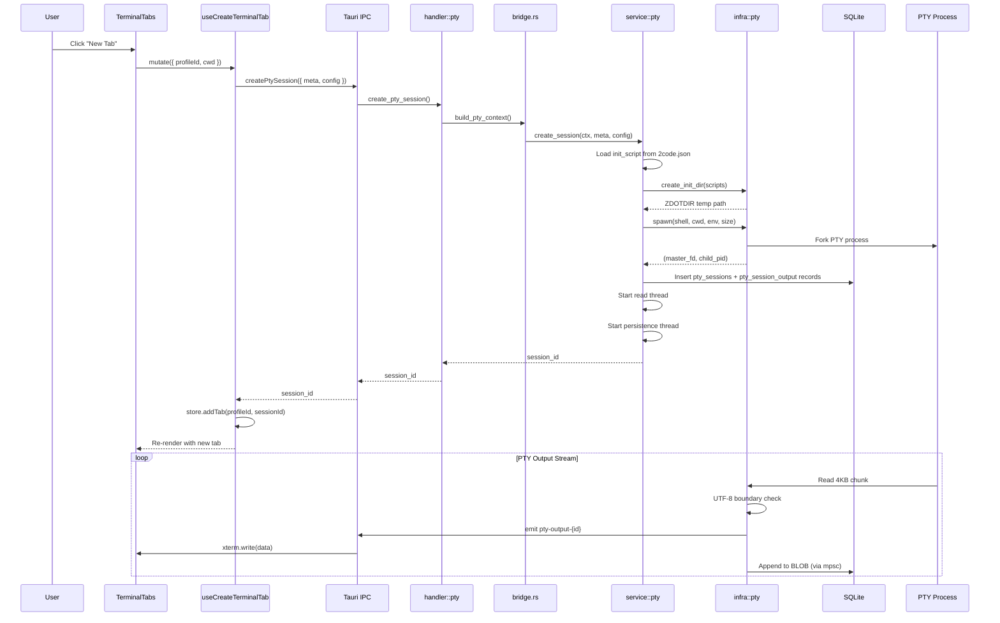
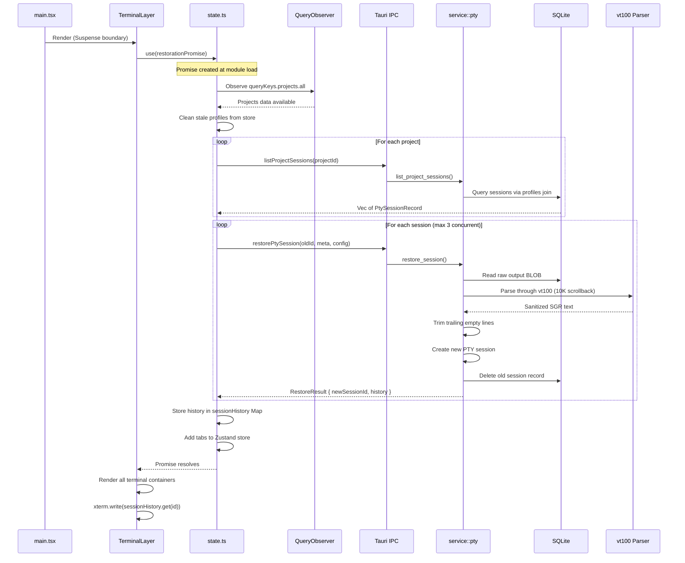
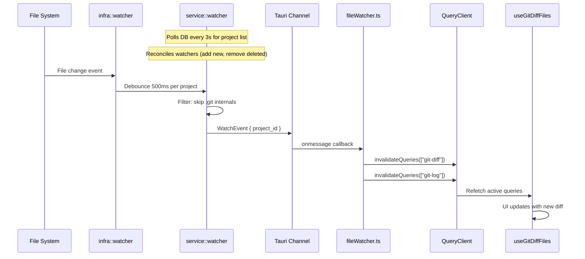
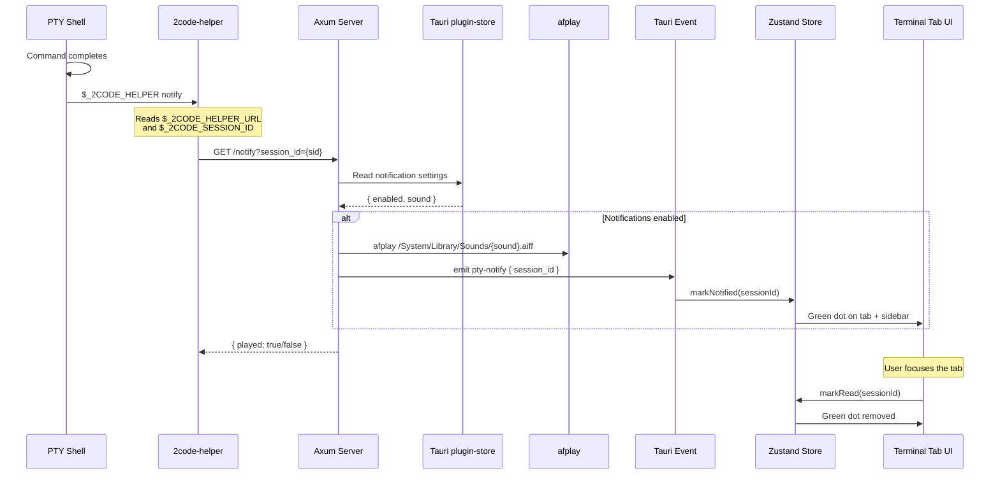

# Data Flow

## Primary Flow: Creating a Terminal Tab



## Session Restoration on App Start



## File Watcher to Git Diff Refresh



## Notification Pipeline



## State Management

### Zustand Stores (Client State)

| Store | File | Persistence | Purpose |
|-------|------|-------------|---------|
| `terminalStore` | `features/terminal/store.ts` | None (rebuilt from DB) | Terminal tabs per profile, notification dots |
| `terminalSettingsStore` | `features/settings/stores/terminalSettingsStore.ts` | localStorage | Font family, font size, terminal themes |
| `themeStore` | `features/settings/stores/themeStore.ts` | localStorage | Accent color, border radius |
| `notificationStore` | `features/settings/stores/notificationStore.ts` | Tauri plugin-store | Sound name, enabled flag |
| `debugStore` | `features/debug/debugStore.ts` | localStorage (partial) | Debug mode toggle, panel state |
| `debugLogStore` | `features/debug/debugLogStore.ts` | None | Log buffer (max 500 entries) |
| `topBarStore` | `features/topbar/store.ts` | localStorage | Active controls, per-control options |

**Module-level side effects:**
- `terminalStore` registers `pty-notify` event listener at import time
- `terminalSettingsStore` syncs `--chakra-fonts-mono` CSS variable via subscription
- `themeStore` syncs `--chakra-radii-l1/l2/l3` CSS variables via subscription

### TanStack Query (Server State)

```typescript
queryKeys = {
  projects: { all: ["projects"] },
  git: {
    branch: (folder) => ["git-branch", folder],
    diff:   (profileId) => ["git-diff", profileId],
    log:    (profileId) => ["git-log", profileId],
    commitDiff: (profileId, hash) => ["git-commit-diff", profileId, hash]
  },
  agent: {
    status:      () => ["agent-status"],
    credentials: () => ["agent-credentials"]
  }
}
```

**Query defaults:** `staleTime: 30s`, `refetchOnWindowFocus: false`, `retry: 1`

**Invalidation patterns:**
- Project/profile mutations → invalidate `queryKeys.projects.all`
- File watcher events → invalidate all `git-diff` and `git-log` queries (prefix match)
- Agent install → invalidate `queryKeys.agent.status()`
