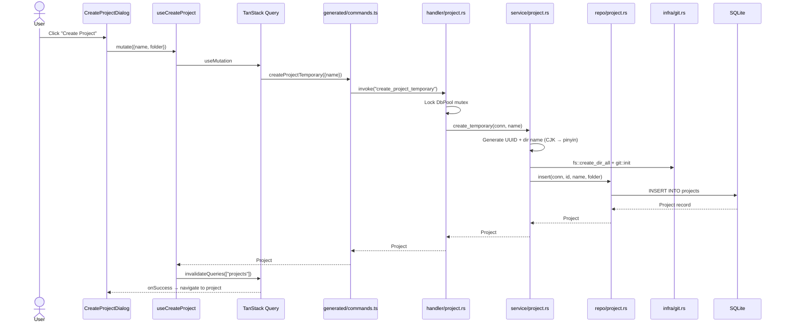
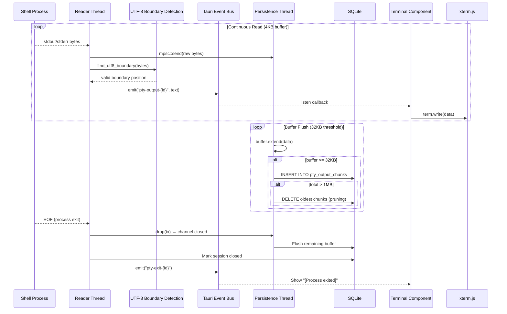
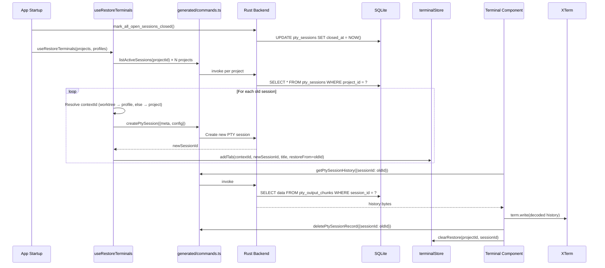
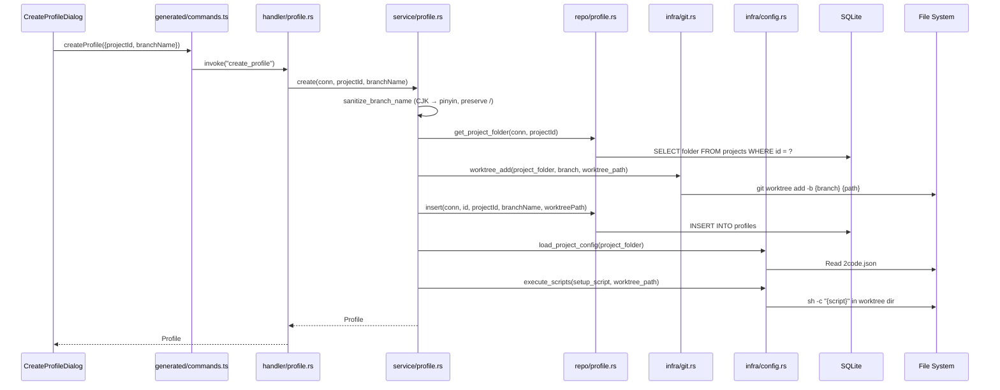

# Data Flow

## Overview

2code uses a hybrid data flow combining **React's unidirectional data flow** on the frontend with **layered command handlers** in the Rust backend. PTY output uses a **streaming event pattern** for real-time terminal updates. All IPC calls use auto-generated typed bindings from `src/generated/`.

## Primary Data Flows

### 1. Project Creation Flow



### 2. Terminal Session Lifecycle


### 3. PTY Output Streaming (Dual-Thread)



### 4. Session Restoration on App Start



### 5. Profile Creation (Git Worktree)



## State Management Patterns

### Frontend State (Zustand)

```
terminalStore: {
  projects: {
    [contextId]: {           // contextId = projectId OR profileId
      tabs: TerminalTab[]    // {id, title, restoreFrom?}
      activeTabId: string
      counter: number
    }
  }
}
```

### Backend State (Rust)

```rust
// Managed by Tauri as application state
PtySessionMap: Arc<Mutex<HashMap<String, PtySession>>>
DbPool: Arc<Mutex<SqliteConnection>>

// PtySession holds the live PTY connection
pub struct PtySession {
    pub master: Box<dyn MasterPty + Send>,
    pub writer: Box<dyn Write + Send>,
    pub child: Box<dyn Child + Send + Sync>,
}
```

## Caching Strategy

| Layer            | Technology             | Strategy                                                                           |
| ---------------- | ---------------------- | ---------------------------------------------------------------------------------- |
| Server State     | TanStack Query         | staleTime: 30s, retry: 1, invalidate on mutations                                  |
| Terminal Output  | SQLite chunks          | 32KB flush threshold, 1MB cap with oldest-chunk pruning                            |
| Session State    | Rust HashMap           | In-memory for active PTY handles, DB for persistence                               |
| Font/Theme Prefs | Zustand + localStorage | Persist middleware, immediate writes                                               |
| Query Keys       | `lib/queryKeys.ts`     | Hierarchical: `["projects"]`, `["profiles", projectId]`, `["git-diff", contextId]` |

## Error Handling Flow

```
Rust Error (AppError enum)
    ↓ thiserror #[error("...")]
Serialize to string via custom Serialize impl
    ↓ Tauri IPC
Frontend catch block (TanStack Query onError / Promise.catch)
    ↓
Display error toast via Chakra UI Toaster
```

Error variants: `IoError`, `LockError`, `PtyError`, `DbError`, `NotFound`, `GitError`
