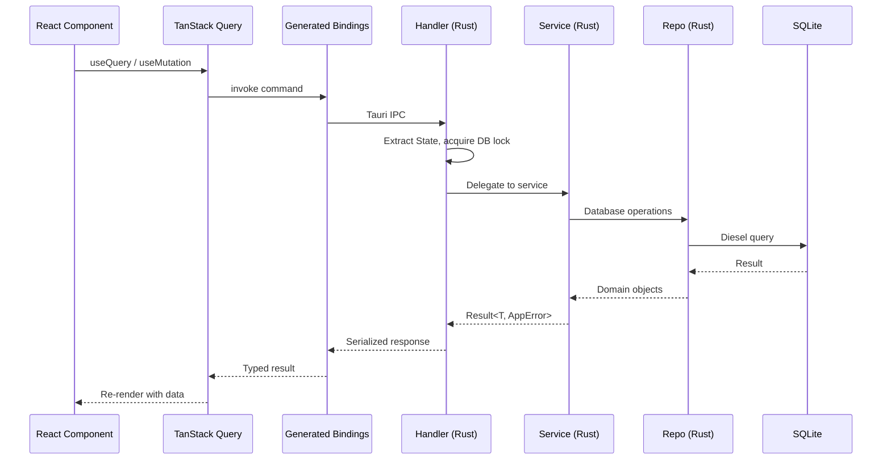
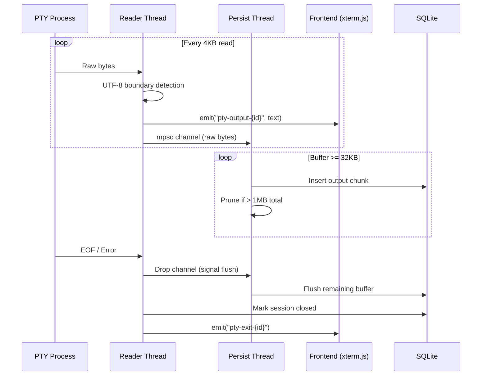
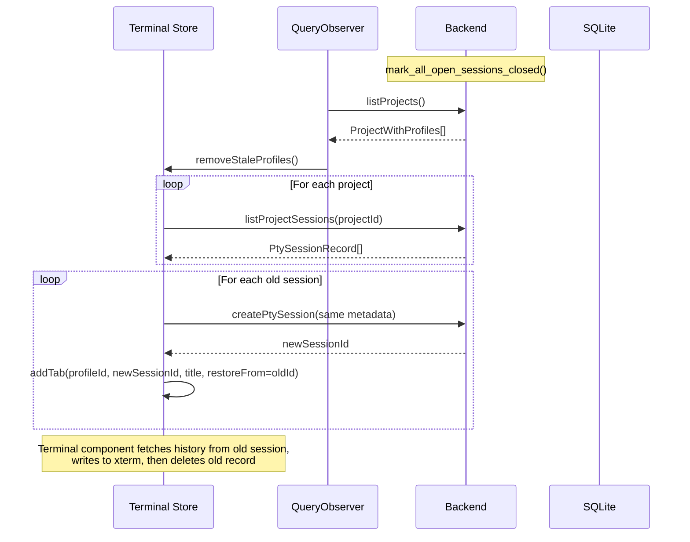
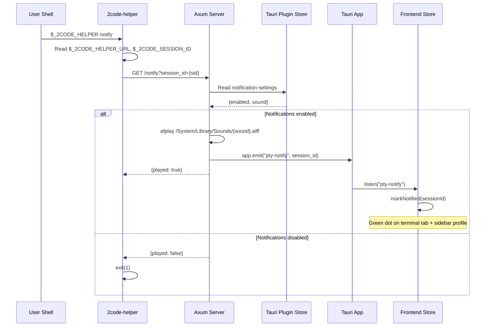
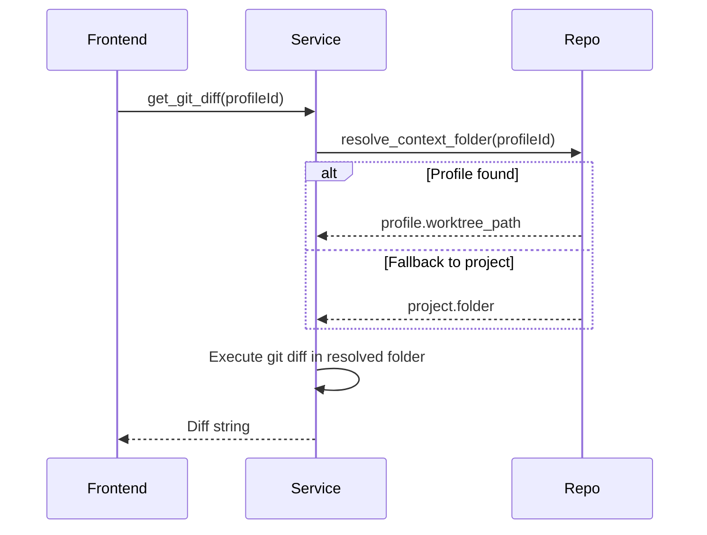

# Data Flow

## IPC Request Lifecycle

All frontend-to-backend communication uses Tauri IPC via auto-generated bindings in `src/generated/`.

## PTY Session Lifecycle

### Creation

1. Frontend calls `createPtySession({ meta, config })` via TanStack Query mutation
2. Handler delegates to `service::pty::create_session()`
3. Service loads project config (`2code.json`) for init scripts
4. Service prepares ZDOTDIR temp directory with shell init script
5. Service reads helper HTTP server state (port + sidecar path)
6. `infra::pty::create_session()` spawns PTY with env vars:
   - `TERM=xterm-256color`
   - `_2CODE_HELPER_URL=http://127.0.0.1:{port}`
   - `_2CODE_HELPER={sidecar_path}`
   - `_2CODE_SESSION_ID={session_id}`
   - `ZDOTDIR={init_dir}` (for shell init injection)
7. Session record inserted into `pty_sessions` table
8. Background reader thread spawned for output streaming

### Output Streaming

Key details:
- Reader thread reads 4KB chunks from PTY
- UTF-8 boundary detection (`find_utf8_boundary`) prevents partial character output to frontend
- Persistence runs on a separate thread via mpsc channel (non-blocking)
- 32KB flush threshold for DB writes
- 1MB cap per session with oldest-chunk pruning

### Session Restoration (App Startup)

This runs once at startup via a module-level `QueryObserver` subscription in `features/terminal/store.ts`.

## Notification Pipeline

Clearing notifications:
- `setActiveTab(profileId, tabId)` → `notifiedTabs.delete(tabId)`
- `closeTab(profileId, tabId)` → `notifiedTabs.delete(tabId)`

## Git Operations & Context ID Resolution

Git operations accept a `profileId` that resolves polymorphically:

## File System Watching

The `watch_projects` command starts a background watcher thread using the `notify` crate. It watches all project folders and emits `watch-event` Tauri events on file changes. The frontend `fileWatcher.ts` module subscribes and invalidates relevant TanStack Query cache entries.

## Profile System (Git Worktrees)

### Creation Flow

1. Frontend calls `createProfile(projectId, branchName)`
2. Service sanitizes branch name (CJK → pinyin via `slug.rs`)
3. Service runs `git worktree add ~/.2code/workspace/{profile_id} -b {branch}`
4. Profile record inserted into `profiles` table
5. If `2code.json` has `setup_script`, execute in worktree directory

### Deletion Flow

1. If `2code.json` has `teardown_script`, execute in worktree directory
2. Run `git worktree remove` and `git branch -D`
3. Delete profile record from DB (cascades to sessions)
