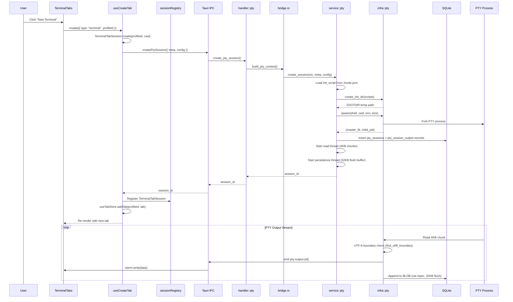
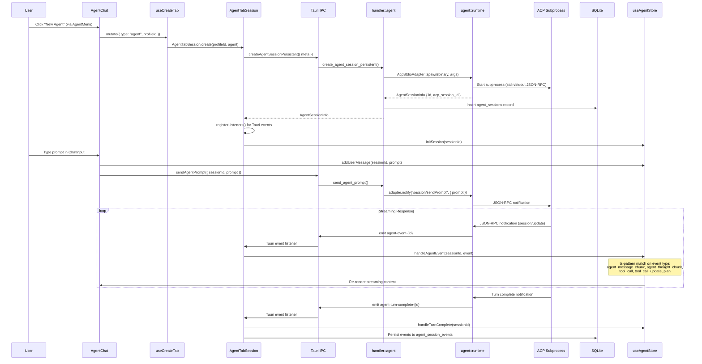
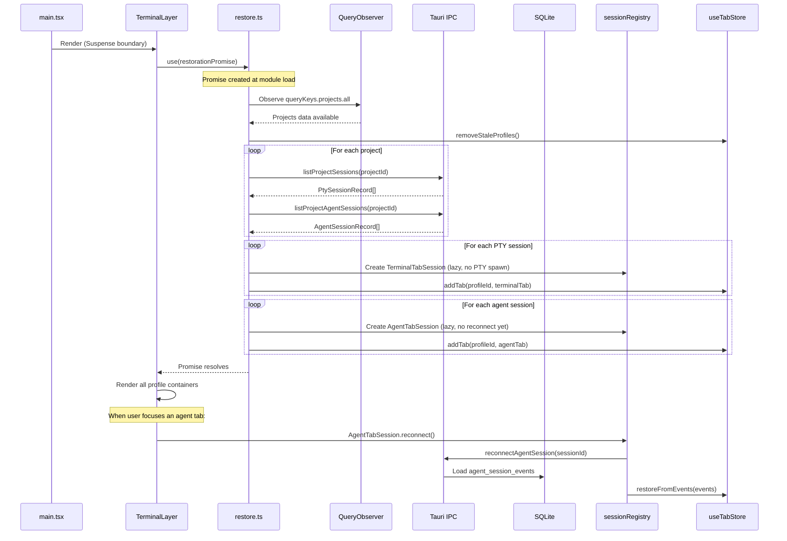
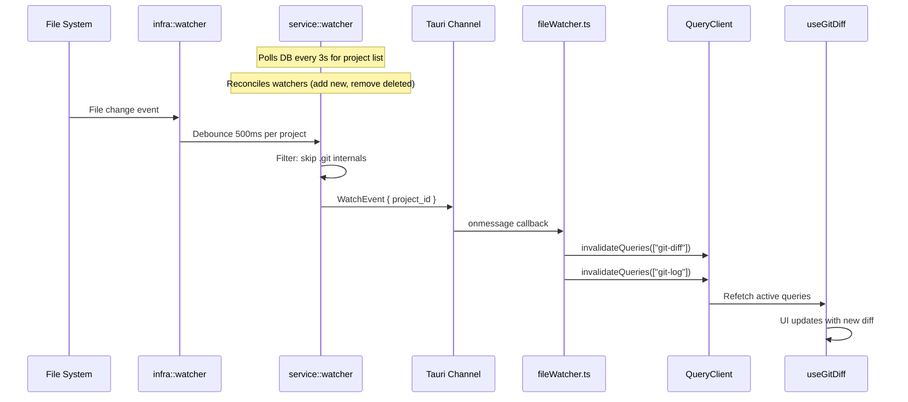

# Data Flow

## Primary Flow: Creating a Terminal Tab



## Agent Tab Creation and Messaging



## Session Restoration on App Start



## File Watcher to Git Diff Refresh



## Notification Pipeline

```mermaid
sequenceDiagram
    participant Shell as PTY Shell
    participant Helper as 2code-helper
    participant Axum as Axum Server
    participant Store as Tauri plugin-store
    participant Sound as afplay
    participant Event as Tauri Event
    participant ZStore as useTabStore
    participant UI as Terminal Tab UI

    Shell->>Shell: Command completes
    Shell->>Helper: $_2CODE_HELPER notify
    Note over Helper: Reads $_2CODE_HELPER_URL<br/>and $_2CODE_SESSION_ID

    Helper->>Axum: GET /notify?session_id={sid}
    Axum->>Store: Read notification settings
    Store-->>Axum: { enabled, sound }

    alt Notifications enabled
        Axum->>Sound: afplay /System/Library/Sounds/{sound}.aiff
        Axum->>Event: emit pty-notify { session_id }
        Event->>ZStore: markNotified(sessionId)
        ZStore->>UI: Green dot on tab + sidebar
    end

    Axum-->>Helper: { played: true/false }

    Note over UI: User focuses the tab
    UI->>ZStore: markRead(sessionId)
    ZStore->>UI: Green dot removed
```



## State Management

### Zustand Stores (Client State)

| Store | File | Persistence | Purpose |
|-------|------|-------------|---------|
| `useTabStore` | `features/tabs/store.ts` | None (rebuilt from DB) | Tab collections per profile, active tab, notification dots |
| `useAgentStore` | `features/agent/store.ts` | None | Agent session state (turns, streaming chunks, errors) per session |
| `terminalSettingsStore` | `features/settings/stores/terminalSettingsStore.ts` | localStorage (`"font-settings"`) | Font family, font size, dark/light terminal themes, sync toggle |
| `themeStore` | `features/settings/stores/themeStore.ts` | localStorage (`"theme-settings"`) | Accent color, border radius |
| `notificationStore` | `features/settings/stores/notificationStore.ts` | Tauri plugin-store (`settings.json`) | Sound name, enabled flag |
| `debugStore` | `features/debug/debugStore.ts` | localStorage (`"debug-settings"`, partial) | Debug mode toggle, panel state |
| `debugLogStore` | `features/debug/debugLogStore.ts` | None | Log buffer (max 1000 entries) |
| `topBarStore` | `features/topbar/store.ts` | localStorage (`"topbar-settings"`) | Active controls, per-control options |

**Module-level side effects:**
- `useTabStore` registers `pty-notify` event listener at import time
- `terminalSettingsStore` syncs `--chakra-fonts-mono` CSS variable via subscription
- `themeStore` syncs `--chakra-radii-l1/l2/l3` CSS variables via subscription

### TanStack Query (Server State)

```typescript
queryKeys = {
  projects: { all: ["projects"] },
  git: {
    branch: (folder) => ["git-branch", folder],
    diff:   (profileId) => ["git-diff", profileId],
    log:    (profileId) => ["git-log", profileId],
    commitDiff: (profileId, hash) => ["git-commit-diff", profileId, hash]
  },
  agent: {
    status:      () => ["agent-status"],
    credentials: () => ["agent-credentials"]
  }
}
```

**Query defaults:** `staleTime: 30s`, `refetchOnWindowFocus: false`, `retry: 1`

**Invalidation patterns:**
- Project/profile mutations → invalidate `queryKeys.projects.all`
- File watcher events → invalidate all `git-diff` and `git-log` queries (prefix match)
- Agent install → invalidate `queryKeys.agent.status()`

### Cross-cutting Data Flows

1. **PTY notifications**: Tauri `pty-notify` event → `useTabStore.markNotified(sessionId)` → `useProfileHasNotification` selector → green dots in `ProfileItem` and `TerminalTabs`
2. **Tab restore**: module-level `restorationPromise` (from `QueryObserver`) → `populateTabs()` → fills `sessionRegistry` and `useTabStore` → `TerminalLayer` suspends on this promise
3. **File watching**: `fileWatcher.ts` side-effect import in `main.tsx` → invalidates git queries on file change
4. **Theme propagation**: `useThemeStore.borderRadius` → CSS variables `--chakra-radii-l1/l2/l3`. `useThemeStore.accentColor` → Chakra `colorPalette` prop. `useTerminalSettingsStore.fontFamily` → CSS variable `--chakra-fonts-mono`
5. **Agent events**: Tauri events `agent-event-{id}`, `agent-turn-complete-{id}`, `agent-error-{id}` → `useAgentStore` actions → `AgentChat` re-renders via Zustand subscription
