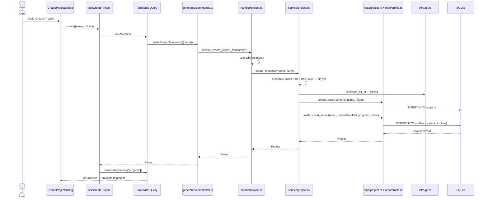
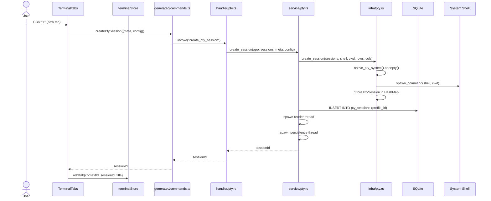
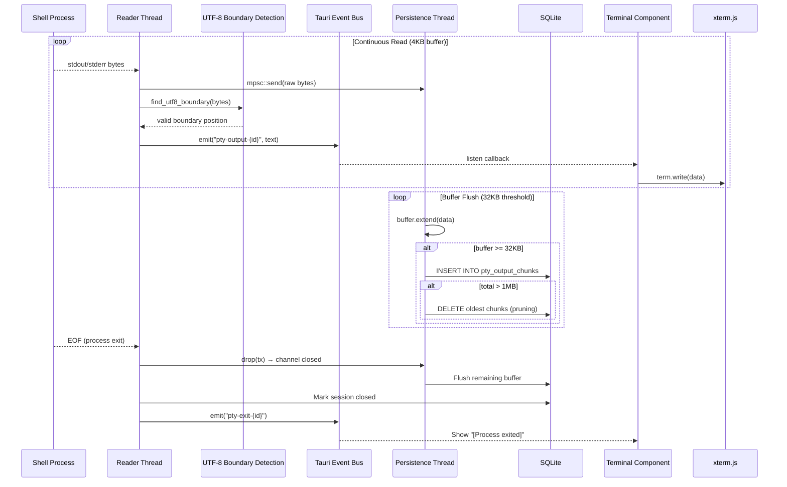
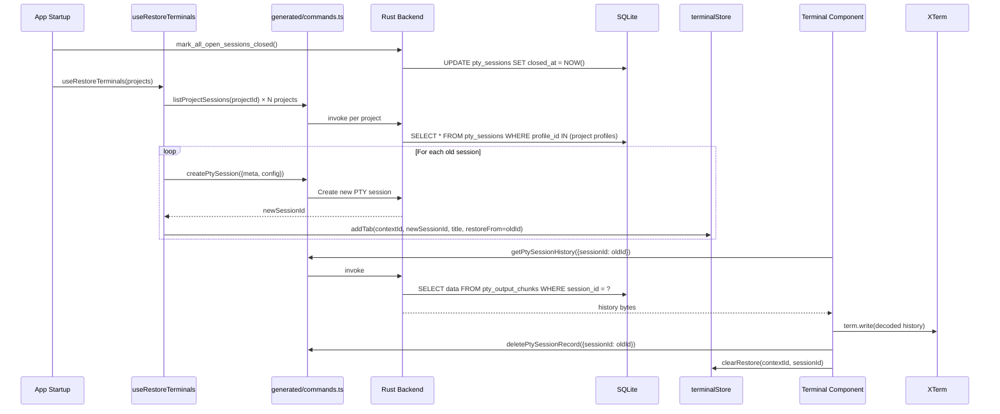
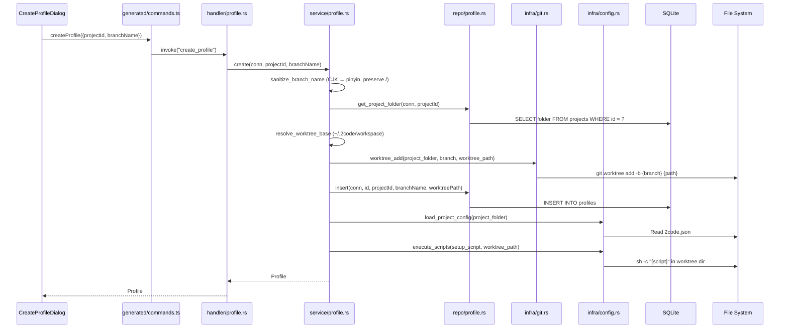
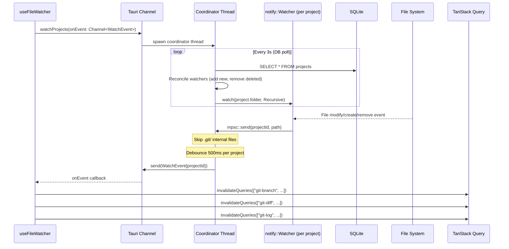
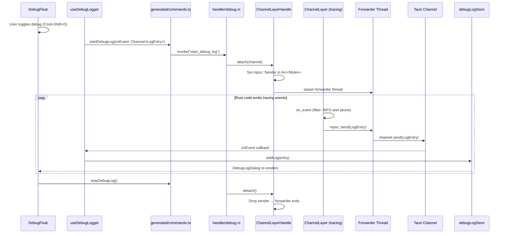

# Data Flow

## Overview

2code uses a hybrid data flow combining **React's unidirectional data flow** on the frontend with **layered command handlers** in the Rust backend. PTY output uses a **streaming event pattern** for real-time terminal updates. File watching and debug logging use **Tauri Channels** for push-based communication. All IPC calls use auto-generated typed bindings from `src/generated/`.

## Primary Data Flows

### 1. Project Creation Flow



### 2. Terminal Session Lifecycle



### 3. PTY Output Streaming (Dual-Thread)



### 4. Session Restoration on App Start



### 5. Profile Creation (Git Worktree)



### 6. File Watcher System



### 7. Debug Log Streaming



## State Management Patterns

### Frontend State (Zustand)

```
terminalStore: {
  projects: {
    [contextId]: {           // contextId = profileId (default or worktree)
      tabs: TerminalTab[]    // {id, title, restoreFrom?}
      activeTabId: string
      counter: number
    }
  }
}
```

### Backend State (Rust)

```rust
// Managed by Tauri as application state
PtySessionMap: Arc<Mutex<HashMap<String, PtySession>>>
DbPool: Arc<Mutex<SqliteConnection>>
WatcherShutdownFlag: Arc<AtomicBool>
ChannelLayerHandle: { tx: Arc<Mutex<Option<mpsc::Sender<LogEntry>>>> }

// PtySession holds the live PTY connection
pub struct PtySession {
    pub master: Box<dyn MasterPty + Send>,
    pub writer: Box<dyn Write + Send>,
    pub child: Box<dyn Child + Send + Sync>,
}
```

## Caching Strategy

| Layer            | Technology                | Strategy                                                                          |
| ---------------- | ------------------------- | --------------------------------------------------------------------------------- |
| Server State     | TanStack Query            | staleTime: 30s, retry: 1, invalidate on mutations and file changes                |
| Terminal Output  | SQLite chunks             | 32KB flush threshold, 1MB cap with oldest-chunk pruning                           |
| Session State    | Rust HashMap              | In-memory for active PTY handles, DB for persistence                              |
| Font/Theme Prefs | Zustand + localStorage    | Persist middleware, immediate writes                                              |
| Query Keys       | `shared/lib/queryKeys.ts` | Hierarchical: `["projects"]`, `["git-branch", folder]`, `["git-diff", profileId]` |

## Error Handling Flow

```
Rust Error (AppError enum)
    ↓ thiserror #[error("...")]
Serialize to string via custom Serialize impl
    ↓ Tauri IPC
Frontend catch block (TanStack Query onError / Promise.catch)
    ↓
Display error toast via Chakra UI Toaster
```

Error variants: `IoError`, `LockError`, `PtyError`, `DbError`, `NotFound`, `GitError`

## App Lifecycle

### Startup

1. Initialize `tracing_subscriber` with console output + `ChannelLayer` for debug forwarding
2. Create `PtySessionMap` and `WatcherShutdownFlag`
3. Register Tauri plugins: `opener`, `dialog`, `notification`
4. `setup`: Initialize SQLite database (`init_db`), run embedded migrations
5. `setup`: Mark orphaned PTY sessions as closed (`mark_all_open_sessions_closed`)
6. Register all 22 command handlers

### Shutdown (`RunEvent::Exit`)

1. Signal watcher thread to stop via `WatcherShutdownFlag`
2. Mark all open PTY sessions as closed in DB
3. Kill all active PTY child processes (`close_all_sessions`)
