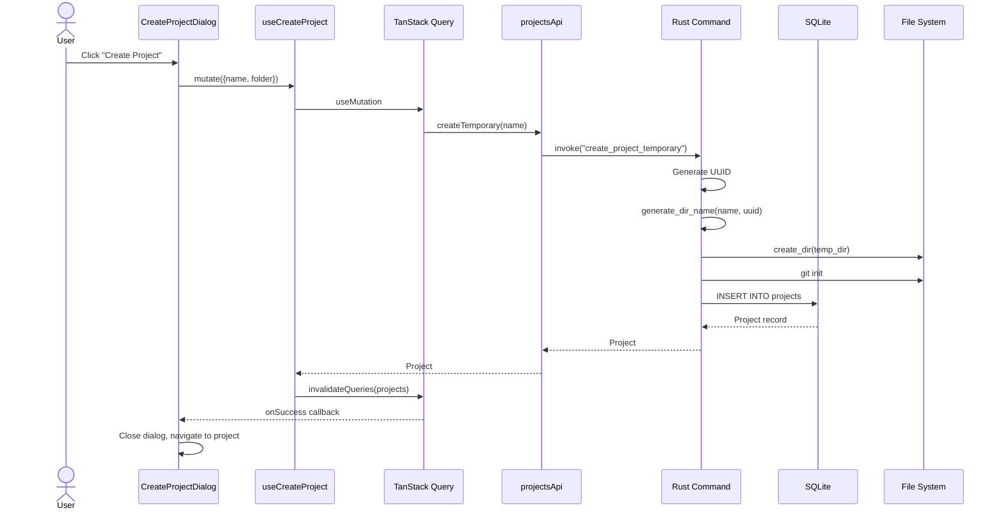
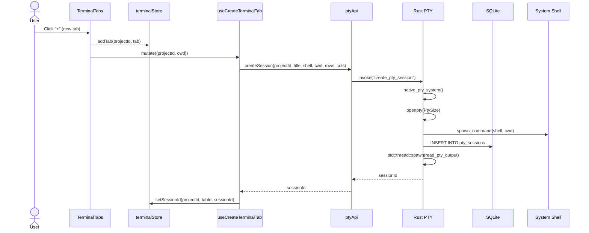
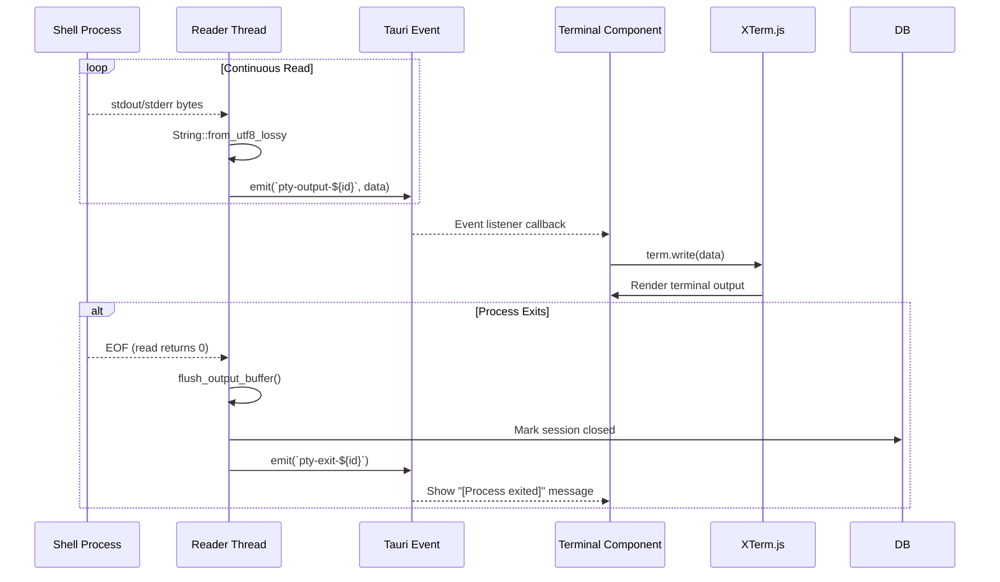

# Data Flow

## Overview

2code uses a hybrid data flow combining **React's unidirectional data flow** on the frontend with **synchronous command handlers** in the Rust backend. PTY output uses a **streaming event pattern** for real-time terminal updates.

## Primary Data Flows

### 1. Project Creation Flow



### 2. Terminal Session Creation Flow



### 3. PTY Output Streaming Flow



### 4. Database Persistence Flow

```mermaid
sequenceDiagram
    participant UI as Terminal Component
    participant Hook as useEffect
    participant API as ptyApi
    participant Rust as Rust Command
    participant DB as SQLite

    %% Restore on mount
    UI->>Hook: useEffect (mount)
    Hook->>Hook: restoreFrom prop set
    Hook->>API: getHistory(oldSessionId)
    API->>Rust: invoke("get_pty_session_history")
    Rust->>DB: SELECT data FROM pty_output_chunks
    DB-->>Rust: Vec&lt;Vec&lt;u8&gt;&gt;
    Rust-->>API: Vec&lt;u8&gt;
    API-->>Hook: history bytes
    Hook->>XTerm: term.write(historyText)
    Hook->>API: deleteRecord(oldSessionId)

    %% Background persistence during session
    loop Output Buffer Flush (32KB threshold)
        Rust->>Rust: output_buffer reaches FLUSH_THRESHOLD
        Rust->>DB: INSERT INTO pty_output_chunks
        Rust->>DB: Prune if total > 1MB
    end
```

## State Management Patterns

### Frontend State (Zustand)

```
terminalStore: {
  projects: {
    [projectId]: {
      tabs: TerminalTab[]
      activeTabId: string
      visible: boolean
      restore?: { oldSessionId: string }
    }
  }
}
```

### Backend State (Rust)

```rust
// Managed by Tauri
PtySessionMap: Arc<Mutex<HashMap<String, PtySession>>>
DbPool: Arc<Mutex<SqliteConnection>>

// PtySession structure
pub struct PtySession {
    pub master: Box<dyn MasterPty + Send>,
    pub writer: Box<dyn Write + Send>,
    pub child: Box<dyn Child + Send + Sync>,
}
```

## Caching Strategy

| Layer            | Technology      | Purpose                                     |
| ---------------- | --------------- | ------------------------------------------- |
| Server State     | TanStack Query  | Cache project list, invalidate on mutations |
| Terminal Output  | SQLite (chunks) | Persistent scrollback history per session   |
| Session State    | Rust HashMap    | In-memory PTY handles for active sessions   |
| Font Preferences | localStorage    | User font selection persistence             |

## Error Handling Flow

```
Rust Error (AppError)
    ↓
Serialize to string via thiserror
    ↓
Tauri invokes reject with error string
    ↓
Frontend catch block (or TanStack Query onError)
    ↓
Display error toast or fallback UI
```

Key error types:

- `IoError`: Filesystem operations
- `LockError`: Mutex poisoning
- `PtyError`: PTY operations
- `DbError`: Database operations
- `NotFound`: Record not found
