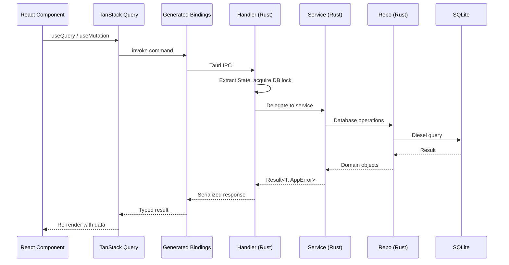
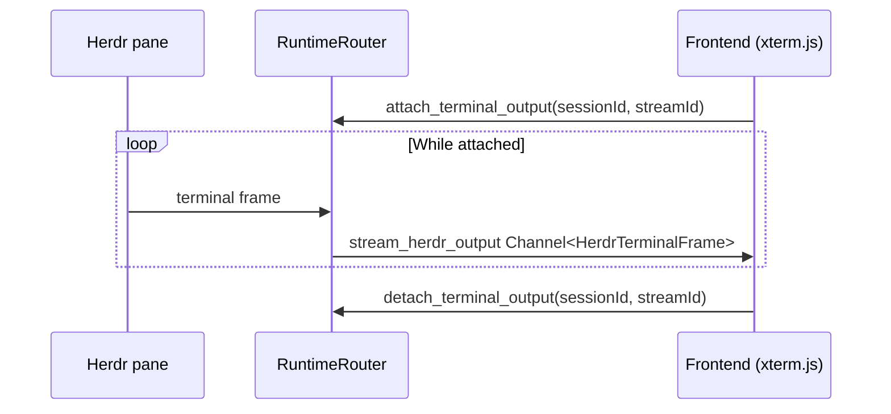
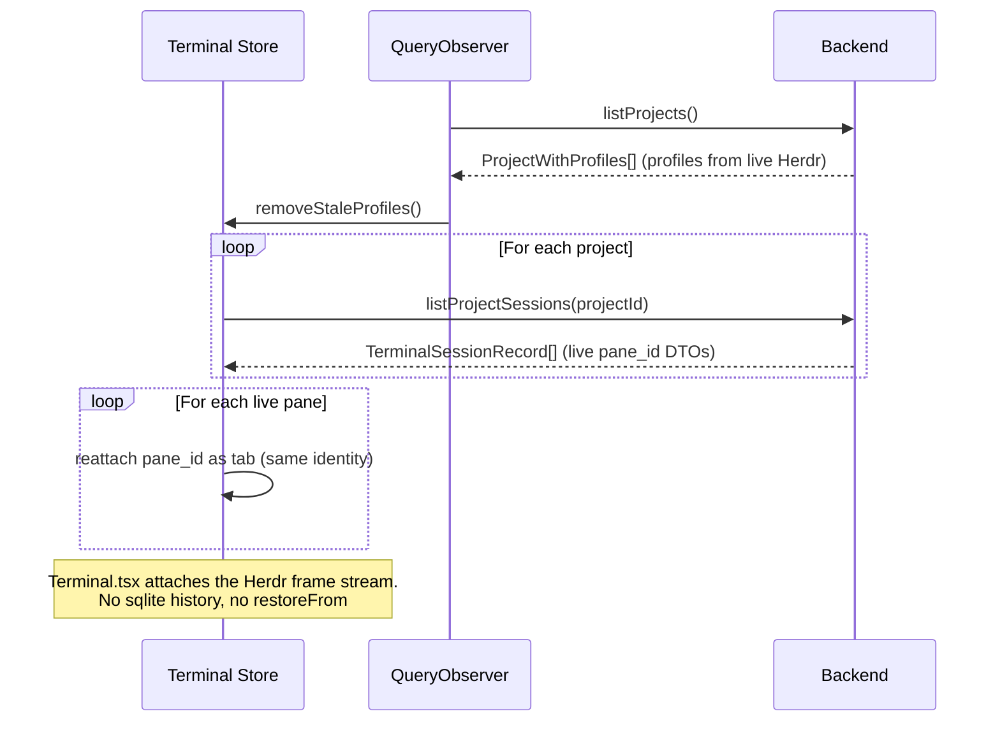
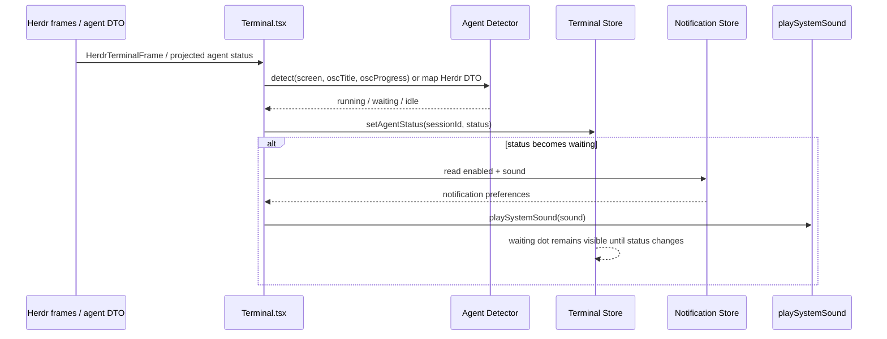
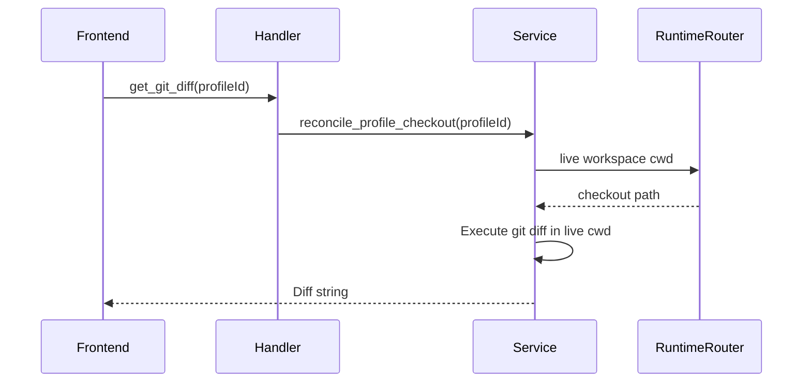

# Data Flow

## IPC Request Lifecycle

All frontend-to-backend communication uses Tauri IPC via auto-generated bindings in `src/generated/`.

```mermaid
sequenceDiagram
    participant C as React Component
    participant TQ as TanStack Query
    participant Gen as Generated Bindings
    participant H as Handler (Rust)
    participant S as Service (Rust)
    participant R as Repo (Rust)
    participant DB as SQLite

    C->>TQ: useQuery / useMutation
    TQ->>Gen: invoke command
    Gen->>H: Tauri IPC
    H->>H: Extract State, acquire DB lock
    H->>S: Delegate to service
    S->>R: Database operations
    R->>DB: Diesel query
    DB-->>R: Result
    R-->>S: Domain objects
    S-->>H: Result<T, AppError>
    H-->>Gen: Serialized response
    Gen-->>TQ: Typed result
    TQ-->>C: Re-render with data
```

Session, profile, and git commands go through Herdr-only [`RuntimeRouter`](../src-tauri/crates/service/src/runtime.rs). sqlite still stores `projects` / `project_groups` / `checkout_notes`. Probe and pin details live in [Herdr integration](herdr-integration.md).

## Terminal Session Lifecycle

Session IPC uses terminal/session names (`create_terminal_session`, `write_to_terminal`, `list_project_sessions`, …). The runtime is Herdr-only: session id is a live `pane_id` (`wN:pK`); `profile_id` is `workspace_id`. There is no Local portable-pty spawn, no `pty_sessions` INSERT, and no `pty_logs` / `gc_orphan_logs`.

### Creation

1. Frontend calls `createTerminalSession({ meta, config })` via TanStack Query mutation
2. Handler delegates to `RuntimeRouter::create_session` ([`handler/terminal.rs`](../src-tauri/src/handler/terminal.rs))
3. Adapter requires a live Herdr `workspace_id` (`meta.profile_id`) and an absolute `config.cwd`
4. New Tab is Herdr `tab.create` in that workspace; the returned session id is the live `pane_id`
5. After create, `2code.json` `init_script` plus `startup_commands` are sent once via `pane.send_input`
6. Herdr-down New Tab fail-closes instead of spawning a Local PTY

### Output Streaming

```mermaid
sequenceDiagram
    participant H as Herdr pane
    participant R as RuntimeRouter
    participant FE as Frontend (xterm.js)

    FE->>R: attach_terminal_output(sessionId, streamId)
    loop While attached
        H->>R: terminal frame
        R->>FE: stream_herdr_output Channel<HerdrTerminalFrame>
    end
    FE->>R: detach_terminal_output(sessionId, streamId)
```

Key details:

- `attach_terminal_output(sessionId, streamId)` registers the active sink; `stream_herdr_output` owns a `Channel<HerdrTerminalFrame>`
- `detach_terminal_output` must pass the same `streamId` so stale React cleanup cannot remove a newer stream for the same session
- `Terminal.tsx` attaches the Herdr frame stream and writes into xterm; there is no sqlite history buffer
- Write/resize/scroll go through the attached Herdr CLI helper. History/flush/clear stay fail-closed
- Close is Herdr `pane.close`. There is no sqlite mark-closed and no orphan-log GC

### Session Restoration (App Startup)

```mermaid
sequenceDiagram
    participant Store as Terminal Store
    participant QO as QueryObserver
    participant BE as Backend

    QO->>BE: listProjects()
    BE-->>QO: ProjectWithProfiles[] (profiles from live Herdr)
    QO->>Store: removeStaleProfiles()

    loop For each project
        Store->>BE: listProjectSessions(projectId)
        BE-->>Store: TerminalSessionRecord[] (live pane_id DTOs)
    end

    loop For each live pane
        Store->>Store: reattach pane_id as tab (same identity)
    end

    Note over Store: Terminal.tsx attaches the Herdr frame stream.<br/>No sqlite history, no restoreFrom
```

This runs once at startup via a module-level `QueryObserver` subscription in `features/terminal/state.ts`. `list_project_sessions` returns every live pane in that project's open workspaces from `session.snapshot` / `HerdrRuntimeSync`. Restore is reattach of that `pane_id`; `restore_session` itself is fail-closed.

## Notification Pipeline

```mermaid
sequenceDiagram
    participant H as Herdr frames / agent DTO
    participant Term as Terminal.tsx
    participant Detector as Agent Detector
    participant Store as Terminal Store
    participant Settings as Notification Store
    participant BE as playSystemSound

    H->>Term: HerdrTerminalFrame / projected agent status
    Term->>Detector: detect(screen, oscTitle, oscProgress) or map Herdr DTO
    Detector-->>Term: running / waiting / idle
    Term->>Store: setAgentStatus(sessionId, status)

    alt status becomes waiting
        Term->>Settings: read enabled + sound
        Settings-->>Term: notification preferences
        Term->>BE: playSystemSound(sound)
        Store-->>Store: waiting dot remains visible until status changes
    end
```

Clearing notifications:

- `setAgentStatus(sessionId, "idle")` after a running state creates a completion marker
- `dismissAgentCompletion(sessionId)` clears the marker
- `closeTab(profileId, tabId)` removes status and completion state for the closed tab

## Git Operations & Live Herdr cwd

Git operations accept a `profile_id` that is a Herdr `workspace_id`. Paths come from [`reconcile_profile_checkout`](../src-tauri/crates/service/src/project.rs) (live `worktree.list` path / snapshot pane `cwd`), not sqlite `profiles.worktree_path`.

```mermaid
sequenceDiagram
    participant FE as Frontend
    participant H as Handler
    participant S as Service
    participant Herdr as RuntimeRouter

    FE->>H: get_git_diff(profileId)
    H->>S: reconcile_profile_checkout(profileId)
    S->>Herdr: live workspace cwd
    Herdr-->>S: checkout path
    S->>S: Execute git diff in live cwd
    S-->>FE: Diff string
```

Unknown `workspace_id` or Herdr-down fail closed (`NotFound`). Watcher Herdr-down still falls back to `projects.folder`. See [Herdr integration](herdr-integration.md).

## File System Watching

The `watch_projects` command starts a background watcher thread using the `notify` crate. Roots come from `list_with_runtime` (live Herdr checkouts; disk-only entries are not profiles). It emits `watch-event` Tauri events on file changes. The frontend `fileWatcher.ts` module subscribes and invalidates relevant TanStack Query cache entries.

## Profile System (Herdr workspaces)

GUI clicks and labels stay **New Profile** / **Delete Profile**. Profile `id` is the Herdr `workspace_id`. sqlite `profiles` is DROPped.

### Creation Flow

1. Frontend calls `createProfile(projectId, branchName)`
2. Service sanitizes branch name (CJK → pinyin via `slug.rs`)
3. Git New Profile: Herdr `worktree.create` at the resolved worktree path (`2code.json` `worktree_dir`, then Settings default, then `~/.2code/workspace`)
4. Non-git New Profile: Herdr `workspace.create --cwd` (the project folder)
5. Returned `Profile.id` is the live `workspace_id`. No sqlite `profiles` INSERT
6. If `2code.json` has `setup_script`, execute in the checkout directory
7. Herdr-down fail-closes; there is no `git worktree add` fallback

### Deletion Flow

1. If `2code.json` has `teardown_script`, execute in the checkout directory
2. Linked git extras: JSON `worktree.remove`, then 2code `git branch -D` on the repo so New Profile can reuse the name. Herdr does not delete the git branch. If `worktree.remove` leaves the checkout in place, fail closed — do not fall back to `git worktree remove`
3. Non-git extras: JSON `workspace.close`. The primary / project-folder checkout is refused
4. sqlite `profiles` is DROPped; there is no profile row to delete. Live tabs are Herdr `pane_id`s, not sqlite sessions
